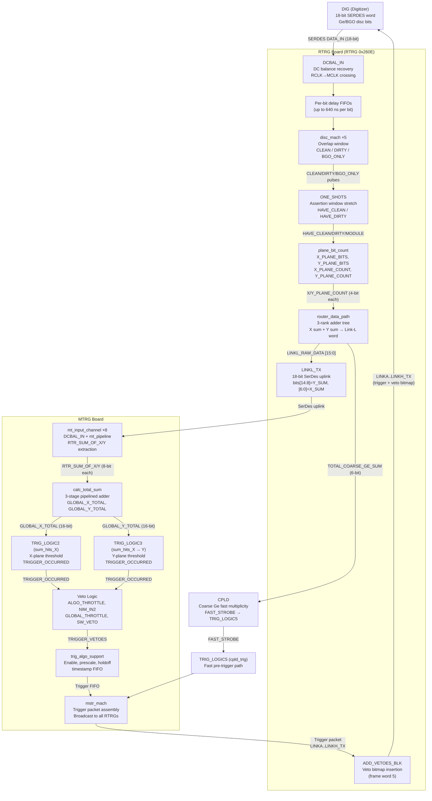

# MTRG Trigger Decision Scheme (RTRG 0x260E → MTRG)
Stability: C3 - Structural / stable
_Firmware: MTRG (current trunk) — consumes RTRG 0x260E link-format data_
_Example: 2-detector DUO (BGO ch-0 → Ge ch-5, BGO ch-1 → Ge ch-6; Y_MAP=A5/A6)_
_Source: `DGS_tools_pack/FPGA/` — mt_input_channel.vhd, eight_mt_channel.vhd, sum_hits_X.vhd, calc_total_sum.vhd, top.vhd_
_Last updated: 2026-04-26_
_Split from: [260E_trigger_scheme.md](260E_trigger_scheme.md) (2026-04-26) — see that file for RTRG-side details (sections 1–4)_

---

## Table of Contents

1. [MTRG Input Channel (mt_input_channel.vhd)](#1-mtrg-input-channel-mt_input_channelvhd)
2. [Eight MT Channel — Global Sum Construction (eight_mt_channel.vhd)](#2-eight-mt-channel--global-sum-construction-eight_mt_channelvhd)
3. [Multiplicity Comparison (sum_hits_X.vhd)](#3-multiplicity-comparison-sum_hits_xvhd)
4. [Total Sum Calculation (calc_total_sum.vhd)](#4-total-sum-calculation-calc_total_sumvhd)
5. [MTRG Trigger Decision (top.vhd)](#5-mtrg-trigger-decision-topvhd)
6. [End-to-End Flow (DUO Example)](#6-end-to-end-flow-duo-example)
7. [Mermaid Flow Diagram](#7-mermaid-flow-diagram)
8. [See Also](#see-also)

---

## 1. MTRG Input Channel (mt_input_channel.vhd)

`mt_input_channel` is the MTRG-side front-end for one RTRG link. Eight instances run in parallel inside `eight_mt_channel.vhd`, one per RTRG connection. It recovers the serial data stream and extracts the X/Y multiplicity sums and status flags for that RTRG.

### 1.1 DC Balance Recovery

The incoming 18-bit DC-balanced SerDes word from the RTRG is decoded by `DCBAL_IN` (U1), which reverses the DC balance encoding applied in the RTRG's `dc_balance_mach`, and crosses from the SERDES receive clock (LVDS_RCLK) into the MTRG master clock domain via an internal FIFO. The result is `UNBAL_ROUTER_DATA[15:0]` — the original Link-L word.

If `DCBAL_BYPASS='1'` (diagnostic mode), the data passes through without decoding.

### 1.2 Stream Parsing — mt_pipeline

`mt_pipeline` (U2) parses the Router serial frame protocol. One complete data cycle runs approximately every 2 µs; each of the 8 digitizers on the RTRG produces its data staggered ~225 ns apart. `mt_pipeline` extracts per-digitizer fields: CHANNEL_ID (8-bit identifier), SPARE words, and status maps including:

| Map | Description |
|---|---|
| `CHAN_MASK_MAP` | Masked (dead) digitizer channels |
| `ROUTER_LOCK_MAP` | Digitizer SERDES lock status |
| `DIG_CODE_ERR_MAP` | Grey-code error flags |
| `DIG_ERROR_MAP` | Digitizer error bits |
| `DIG_PILEUP_MAP` | Pileup flags |
| `THROTTLE_REQ_MAP` | Per-digitizer throttle requests |

`TRAILER_FLAG` pulses once per Router data cycle at the end of the frame, used by `eight_mt_channel` to synchronize global sum updates.

### 1.3 Multiplicity Extraction

```
MULTIPLICITY[3:0] <= UNBAL_ROUTER_DATA[15:12]  (when not masked)
```
✅ verified 2026-04-18 — `mt_input_channel.vhd:L183` (MTRG/MAIN_FPGA/20120424): `MULTIPLICITY <= UNBAL_ROUTER_DATA(15 downto 12) when (CHANNEL_MASK = '0') else "0000"`

This extracts the top 4 bits of the recovered Link-L word. In the current RTRG 0x260E format, bit [15] = throttle ✅ verified 2026-04-30 — `VIVADO_MAIN_FPGA/trunk/Source/mt_input_channel.vhd:L120`: `THROTTLE_REQUEST <= UNBAL_ROUTER_DATA(15)`, bits [14:12] = top 3 bits of the 7-bit Y-plane sum. The `MULTIPLICITY` output therefore reflects a partial Y-count (the upper 3 bits, i.e., the value divided by 16 in 7-bit terms) — useful for rapid multiplicity prescreening without needing the full 7-bit sum.

The full X and Y sums (bits [6:0] and [14:8] of the Link-L word) are consumed by higher-level blocks in `eight_mt_channel` that read `RTR_SUM_OF_X` and `RTR_SUM_OF_Y` directly.

### 1.4 Channel Masking

If `CHANNEL_MASK='1'` (this entire RTRG disabled at the MTRG level):
- All CHANNEL_ID and SPARE outputs are zeroed.
- `MULTIPLICITY` is forced to zero.
- `THROTTLE_REQUEST` is forced to zero.
Invalid digitizer slots (`DIGVALID='0'`) within an active RTRG get CHANNEL_ID = 0xFF.

### 1.5 DUO Example — mt_input_channel

The RTRG connected to our 2-detector DUO transmits Link-L with `Y_SUM = 2`. At the MTRG:
- `DCBAL_IN` recovers the 16-bit word.
- `UNBAL_ROUTER_DATA[14:8] = 0b0000010 = 2`.
- `MULTIPLICITY[3:0] = UNBAL_ROUTER_DATA[15:12] = 0b0000` (throttle=0, Y[6:4]=0 → multiplicity shows 0 at this partial extraction, since the count of 2 fits in the lower bits of the 7-bit Y field).
- The full Y sum of 2 is passed to `eight_mt_channel` via the recovered word for proper summing.

---

## 2. Eight MT Channel — Global Sum Construction (eight_mt_channel.vhd)

`eight_mt_channel` bundles eight `mt_input_channel` instances (one per RTRG, Router links A–H) with a `calc_total_sum` adder and assembles the detector-wide X and Y multiplicity totals. It is the aggregation point that turns per-RTRG partial sums into global sums ready for the trigger decision.

### 2.1 Per-RTRG Sum Extraction

Each `mt_input_channel` instance in the trunk variant exposes two additional outputs beyond the base version:

- `RTR_SUM_OF_X[7:0]` — the 7-bit X-plane multiplicity sum from that RTRG's Link-L word (bits [6:0]) ✅ verified 2026-04-30 — `VIVADO_MAIN_FPGA/trunk/Source/mt_input_channel.vhd:L125`: `RTR_SUM_OF_X <= "0" & UNBAL_ROUTER_DATA(6 downto 0)`
- `RTR_SUM_OF_Y[7:0]` — the 7-bit Y-plane multiplicity sum from that RTRG's Link-L word (bits [14:8]) ✅ verified 2026-04-30 — `VIVADO_MAIN_FPGA/trunk/Source/mt_input_channel.vhd:L126`: `RTR_SUM_OF_Y <= "0" & UNBAL_ROUTER_DATA(14 downto 8)`; also confirms bit [7]=DATA_VALID gate (L121: `if(UNBAL_ROUTER_DATA(7) = '0') then ... RTR_SUM_OF_X/Y <= X"00"`)

These are 8-bit fields (the 7-bit RTRG sum zero-extended to 8 bits), accommodating the maximum of 80 hits per RTRG (8 channels × 10 discriminator bits each).

### 2.2 Global Sum via calc_total_sum

The `calc_total_sum` instance receives all eight `RTR_SUM_OF_X` and `RTR_SUM_OF_Y` arrays and produces:

- **`GLOBAL_X_TOTAL[15:0]`** — 16-bit total X-plane multiplicity across all 8 RTRGs (max 640; 10 bits significant) ✅ verified 2026-04-18 — `calc_total_sum.vhd:L22-23` (std_logic_vector(15 downto 0))
- **`GLOBAL_Y_TOTAL[15:0]`** — 16-bit total Y-plane multiplicity across all 8 RTRGs (max 640; 10 bits significant) ✅ verified 2026-04-18 — `calc_total_sum.vhd:L22-23` (std_logic_vector(15 downto 0))

The summation is performed in `calc_total_sum` via a 3-stage pipelined adder tree (detailed in section 8).

### 2.3 Global Throttle

`THROTTLE_PROC` registers the OR of all eight `THROTTLE_REQUEST` bits from the `mt_input_channel` instances:

```
GLOBAL_THROTTLE_REQUEST <= '1' if any xROUTER_THROTTLE_REQUESTS(i) = '1'
```

This single bit propagates to the top-level trigger logic to suppress triggers during busy periods.

### 2.4 Channel Status and Masking

- `CHANNEL_STATUS[7:0]` — LOAD_ERR bits from each `mt_input_channel` (link not locked → error)
- `CHANNEL_STATUS[15:8]` — per-Router throttle request bits
- `INPUT_LINK_MASK_REG[7:0]` — per-Router mask; masked channels contribute zero to all sums

### 2.5 DUO Example — eight_mt_channel

In the DUO, only one RTRG (say, link A) is populated. The remaining 7 `mt_input_channel` instances are either masked or report LOAD_ERR. Link A's `mt_input_channel` provides:
- `RTR_SUM_OF_X[7:0] = 0`
- `RTR_SUM_OF_Y[7:0] = 2`

After `calc_total_sum`:
- `GLOBAL_X_TOTAL = 0`
- `GLOBAL_Y_TOTAL = 2`

These feed directly into the trigger comparison blocks.

---

## 3. Multiplicity Comparison (sum_hits_X.vhd)

`sum_hits_X` implements the X-plane multiplicity trigger algorithm. An equivalent Y-plane version handles `GLOBAL_Y_TOTAL`. Both modules share the same structure.

### 3.1 Threshold Comparison — Two-State Machine

The core logic is a simple 2-state leading-edge detector:

| State | Condition | Action |
|---|---|---|
| **WAIT_TRIG** (armed) | `SUM_OF_X > SUM_OF_X_THRESH` | Assert `TRIGGER_OCCURRED` for one tick; go to WAIT_FALL |
| **WAIT_FALL** (fired) | `SUM_OF_X > SUM_OF_X_THRESH` | Stay (de-assert TRIGGER_OCCURRED immediately after the one tick) |
| **WAIT_FALL** (fired) | `SUM_OF_X ≤ SUM_OF_X_THRESH` | Return to WAIT_TRIG (re-arm) |

The comparison is **strictly greater than** (`>`), not `≥`. So `SUM_OF_X_THRESH = 1` fires when the sum reaches 2 or above. ✅ verified 2026-04-25 — `sum_hits_X.vhd:L65-92` (20180507 trunk; type `SUM_STATES is (WAIT_TRIG, WAIT_FALL)`; comparison at L80: `if (SUM_OF_X > SUM_OF_X_THRESH)`; re-arm at L92: `SUM_STATE <= WAIT_TRIG` when sum ≤ threshold)

This produces exactly one `TRIGGER_OCCURRED` pulse per threshold-crossing event, no matter how long the sum remains above threshold. Re-arming requires the sum to fall back to or below the threshold.

### 3.2 Trigger Support Infrastructure (trig_algo_support)

The `TRIGGER_OCCURRED` one-tick pulse is passed to `trig_algo_support`, a generic sub-component shared by all MTRG algorithm blocks. It handles:

| Feature | Signal | Description |
|---|---|---|
| Enable gate | `TRIGGER_ENABLE` | VME bit; if '0', triggers are counted but not issued |
| Veto | `TRIGGER_VETO` | External veto (e.g., from throttle); suppresses accepted triggers |
| Self-holdoff | `TRIGGER_HOLDOFF`, `TRIG_HOLDOFF_ENBL` | After firing, suppresses re-triggering for N×20 ns ticks |
| Prescale | `TRIGGER_PRESCALE` | Accept 1 in every N+1 crossings |
| Timestamp FIFO | `TIME_STAMP_BUS` | Captures 48-bit timestamp at trigger time; queued in FIFO for Master collector |
| Distribution mask | `TRIG_DIST_MASK` | 8-bit mask of which RTRGs/digitizers receive this trigger type |
| Throttle feedback | `ALGO_THROTTLE_REQUEST` | Fires when trigger FIFO exceeds 50% full |

### 3.3 Acknowledge Outputs

Three acknowledge signals serve different monitoring roles:

| Signal | Meaning |
|---|---|
| `RAW_NONVETOED_TRIG_ACK` | Threshold crossed + not vetoed (enable ignored) — used by coincidence matrix |
| `ENABLED_TRIG_ACK` | Threshold crossed + enabled (veto ignored) — used for rate counting |
| `ENABLED_NONVETOED_TRIG_ACK` | Threshold crossed + enabled + not vetoed — the actual accepted trigger |

### 3.4 DUO Example — Y-Plane Multiplicity Trigger

With Y-plane threshold set to 1 (fires when `GLOBAL_Y_TOTAL > 1`, i.e., ≥ 2):

- Both Ge ch-5 and Ge ch-6 fire clean hits within the assertion window → `GLOBAL_Y_TOTAL = 2`.
- `sum_hits_Y`: `2 > 1` → `TRIGGER_OCCURRED` pulses.
- `trig_algo_support`: checks TRIGGER_ENABLE and TRIGGER_VETO → if clear, records timestamp, asserts `ENABLED_NONVETOED_TRIG_ACK`, writes event to FIFO.
- After firing, `WAIT_FALL` state holds until `GLOBAL_Y_TOTAL` drops back to ≤ 1 before re-arming.

---

## 4. Total Sum Calculation (calc_total_sum.vhd)

`calc_total_sum` is the adder that merges up to eight per-RTRG X/Y sums into the detector-wide `X_TOTAL` and `Y_TOTAL` signals that feed the threshold comparators in `sum_hits_X`.

### 4.1 Three-Stage Pipelined Adder Tree

All arithmetic is registered, one stage per clock, for a total of **3 clock cycles (60 ns at 50 MHz)** of pipeline latency from per-RTRG sums to final totals:

| Stage | Operation | Output width |
|---|---|---|
| **SUMPROC1** | Pair-wise add: RTR(1)+RTR(2), RTR(3)+RTR(4), RTR(5)+RTR(6), RTR(7)+RTR(8) | 4× 16-bit subtotals per plane |
| **SUMPROC2** | Add pairs of stage-1 results: SUBTOTAL1+2, SUBTOTAL3+4 | 2× 16-bit subtotals per plane |
| **SUMPROC3** | Final add: SUBTOTAL5+SUBTOTAL6 | 16-bit X_TOTAL and Y_TOTAL |

Maximum value: 8 RTRGs × 80 max hits/RTRG = 640 → fits in 10 bits; 16 bits allocated (wider than needed, matches `std_logic_vector(15 downto 0)` port definition). ✅ verified 2026-04-18 — `calc_total_sum.vhd:L22-23,L82-90,L104-105,L120-121` (20180507 tag; all subtotals and X/Y_TOTAL are 16-bit; SUMPROC1/2/3 each registered on CLK edge = 3-cycle pipeline confirmed)

> **Correction (2026-04-18):** Previously documented as 11-bit; VHDL source shows 16-bit throughout.

### 4.2 Y_TOTAL Signal Widths

✅ verified 2026-04-17 — `calc_total_sum.vhd` (20180507 trunk, L35-39): Both `XSUBTOTAL5/6` and `YSUBTOTAL5/6` are correctly declared as `std_logic_vector(15 downto 0)`. The Y path is not truncated. An earlier claim in this document that `YSUBTOTAL5/6` were only 2 bits wide was **incorrect** — no such bug is present in any available firmware tag (20140318, 20140918, 20180507 all verified).

All stage-2 intermediate signals (XSUBTOTAL1–6, YSUBTOTAL1–6) are 16 bits wide, providing ample headroom for summing up to 8 RTRGs × 80 hits/RTRG = 640 max, which fits in 10 bits.

### 4.3 DUO Example — calc_total_sum

Only one RTRG populated (link A); the other seven contribute zero:
- Stage 1: `XSUBTOTAL1 = 0+0 = 0`, `YSUBTOTAL1 = 2+0 = 2`; all others zero.
- Stage 2: `XSUBTOTAL5 = 0`, `YSUBTOTAL5 = 2` (16-bit intermediate — no truncation).
- Stage 3: `X_TOTAL = 0`, `Y_TOTAL = 2`.

All intermediate widths are 16 bits (see section 8.2), so the result is exact for any sum up to 640.

---

## 5. MTRG Trigger Decision (top.vhd)

The MTRG `trigger_top` entity is the hub where all per-RTRG data converges, trigger algorithms run, veto conditions are evaluated, and final trigger decisions are broadcast back to all RTRGs.

### 5.1 Trigger Algorithm Slots (TRIG_LOGIC1–8)

The MTRG supports 8 simultaneous trigger algorithm slots:

| Slot | Module | Input | Description |
|---|---|---|---|
| TRIG_LOGIC1 | `cpld_trig` | `SIMPLE_TRIGGER` (NIM/manual pulse) | NIM or software trigger; type 0x50 |
| **TRIG_LOGIC2** | **`sum_hits_X`** | **`GLOBAL_X_TOTAL`** | **X-plane multiplicity threshold; type 0x51** |
| **TRIG_LOGIC3** | **`sum_hits_X` (Y reuse)** | **`GLOBAL_Y_TOTAL`** | **Y-plane multiplicity threshold (same module, different port mapping)** |
| TRIG_LOGIC4 | `sum_hits_XY` | `GLOBAL_X_TOTAL + GLOBAL_Y_TOTAL` | Combined X+Y multiplicity |
| TRIG_LOGIC5A | `cpld_trig` | `FAST_STROBE` (CPLD) | Fast CPLD pre-trigger strobe; type 0x54 ✅ verified 2026-04-27 — `Generated_top.vhd:L3675` |
| TRIG_LOGIC5B | `local_trig_coinc` | other algo ACKs | Coincidence trigger (any subset of algos 1–8); type 0x54 ✅ verified 2026-04-27 — `Generated_top.vhd:L3721` |
| TRIG_LOGIC6 (ISE trunk) | `REMOTE_MASTER_TRIG_SUPPORT` | Link L | Remote master trigger from link L; trigger type = `LINK_L_TRIG_TYPE` (dynamic, set by remote) ✅ verified 2026-04-27 — `Generated_top.vhd:L3768`
| TRIG_LOGIC6A (VIVADO trunk) | `GITMO_TRIGGER` | VXI GITMO | Legacy analog Gammasphere VXI trigger; type 0x56 ✅ verified 2026-04-27 — `VIVADO/top.vhd:L2546`; removed 20220412 |
| TRIG_LOGIC6B (VIVADO trunk) | `REMOTE_MASTER_TRIG_SUPPORT` | Link L | Remote master trigger from link L ✅ verified 2026-04-27 — `VIVADO/top.vhd:L2601` |
| TRIG_LOGIC7 | `REMOTE_MASTER_TRIG_SUPPORT` | Link R | Remote master trigger input |
| TRIG_LOGIC8A/B | `MYRIAD_TRIGGER` / `REMOTE_MASTER_TRIG_SUPPORT` | Link U / MYRIAD | MYRIAD or remote master |

**Key architecture note**: TRIG_LOGIC3 (Y-plane trigger) is literally a second instantiation of `sum_hits_X.vhd`, with `GLOBAL_Y_TOTAL` wired to its `SUM_OF_X` port and `SUM_OF_Y_THRESH` to its `SUM_OF_X_THRESH`. There is no separate `sum_hits_Y.vhd`. ✅ verified 2026-04-17 — `top.vhd:L2423,L2438-2439` (`TRIG_LOGIC3: sum_hits_X` with `SUM_OF_X => GLOBAL_Y_TOTAL, SUM_OF_X_THRESH => SUM_OF_Y_THRESH`)

✅ verified 2026-04-17 — `sum_hits_X.vhd` (20180507 trunk, L80): The threshold comparison uses **strictly greater than (`>`)** only — `if (SUM_OF_X > SUM_OF_X_THRESH)`. There is no `COMPARE_MODE_CTL` bit or `==` mode in this file. An earlier claim that `SUM_OF_X_THRESH[15]` selects between `>` and `==` comparison was **incorrect** — the threshold is treated as a full 16-bit unsigned value with no mode-selection bit.

### 5.2 Veto Logic

Each algorithm slot has an independent veto signal `TRIGGER_VETOES(i)`. A veto is asserted via an `if/elsif` chain in `VETO_PROC_BLOCK` (one process per algorithm). The chain is evaluated in this order (first match wins): ✅ verified 2026-04-25 — `top.vhd:L1474-1495` (20180507 trunk; `VETO_PROC_BLOCK` generate loop for i in 1 to 8)

1. **NIM_IN2** active — with `TRIG_MASK_REG(14)='1'` AND `TRIG_VETO_SELECT(i)(0)='1'` (`L1479-1480`)
2. **GLOBAL_THROTTLE_REQUEST** — any RTRG is throttling — with `TRIG_MASK_REG(15)='1'` AND `TRIG_VETO_SELECT(i)(2)='1'` (`L1482-1483`)
3. **MON7_VETO_REQUEST** — monitor FIFO #7 overflow — with `TRIG_MASK_REG(13)='1'` (no per-algo select; global only) (`L1486-1487`)
4. **VETO_FROM_VETO_RAM** — target wheel position veto (added 2015-07-20) — with `TRIG_MASK_REG(12)='1'` AND `TRIG_VETO_SELECT(i)(1)='1'` (`L1489-1490`)
5. **ALGO_THROTTLE_REQUEST(i)** — this algorithm's own trigger FIFO exceeds 50% full. *Unconditional — no mask bit, no per-algo select. Code comment: "cannot be disabled, as not responding to them is fatal."* (`L1491-1493`)
6. Else: `TRIGGER_VETOES(i) <= '0'` (`L1494-1495`)

> **Correction (2026-04-25):** An earlier version of this section listed ALGO_THROTTLE as item 1 (highest priority) and software veto / ANY_VETO_FROM_REMOTE_MASTER as items 6–7. In the 20180507 trunk, ALGO_THROTTLE is the **last** item in the `elsif` chain (item 5). There is no software veto (TRIG_MASK_REG(11)) or ANY_VETO_FROM_REMOTE_MASTER term in `VETO_PROC_BLOCK` in this firmware version.

### 5.3 Master State Machine (mstr_mach) — Trigger Distribution

`mstr_mach` (U2) collects trigger events from all 8 algorithm FIFOs, builds formatted trigger packets, and distributes them to all 8 RTRGs simultaneously via `LINKA..LINKH_TX`. The RTRGs forward these decisions to their digitizers (with veto bitmaps embedded in frame word 5 as described in section 4.2). ✅ verified 2026-04-27 — `top.vhd:L2413-2429` (20180507 trunk; TRIG_LOGIC5 uses `cpld_trig`, `SIMPLE_TRIGGER => xxxxFAST_STROBE`, `TRIG_TYPE => X"54"`; edge detector at L3887-3899 produces xxxxFAST_STROBE one-tick pulse from xFAST_STROBE pad)

`mstr_mach` also manages:
- System synchronization frames (Sync and Imperative Sync)
- Communication with remote Master Triggers via Links L, R, and U
- Frame 12 insertion for Router-specific command delivery

### 5.4 ExtTTCL / FAST_STROBE Path

`FAST_STROBE` arrives from the on-board "Fast Strobe CPLD" (MTRG board, referenced at `top.vhd:L1205,L1900-1902`). The RTRG FPGA computes a 6-bit `TOTAL_COARSE_GE_SUM` from per-digitizer coarse Ge discriminator counts and transmits it to the RTRG board's own CPLD via 3-bit DDR on the SUMCOPY bus (`RTRG/TOP.VHD:L870-896`; D1=bits[2:0], D2=bits[5:3]). The RTRG CPLD uses this coarse sum to generate a fast pre-trigger strobe. The relationship between the RTRG CPLD output and the MTRG FAST_STROBE input is board-level wiring (not in VHDL); the MTRG SUMCOPY bus carries VME address bits to the MTRG CPLD, not coarse Ge sums (`top.vhd:L1096-1117`). On the MTRG side, `FAST_STROBE` drives TRIG_LOGIC5 (`cpld_trig`) as a one-tick edge pulse (`xxxxFAST_STROBE`) — bypassing the full RTRG SerDes pipeline latency. ✅ verified 2026-04-27 — `top.vhd:L169` (FAST_STROBE input port, comment: "fast strobe decision from external CPLD"); `L1979` (IBUF pad); `L3947-3957` (3-stage edge detector proc); `L2492,L2507` (TRIG_LOGIC5:cpld_trig, SIMPLE_TRIGGER=>xxxxFAST_STROBE). ⚠️ unverified - source needed: exact board-level wiring path between RTRG CPLD FAST_STROBE output and MTRG FAST_STROBE input pin; schematic not in available sources.

### 5.5 DUO Example — MTRG Trigger Decision

With `GLOBAL_Y_TOTAL = 2` and `SUM_OF_Y_THRESH = 1` (i.e., fire when Y > 1):

1. **TRIG_LOGIC3** (`sum_hits_X` reused for Y): `2 > 1` → `TRIGGER_OCCURRED` pulses.
2. Veto check: ALGO_THROTTLE = 0, GLOBAL_THROTTLE = 0, NIM_IN2 inactive → `TRIGGER_VETOES(3) = 0`.
3. `trig_algo_support` in TRIG_LOGIC3: accepts the trigger, captures timestamp, writes to FIFO.
4. `mstr_mach` reads FIFO, builds trigger packet with type code (Y-plane multiplicity), asserts trigger on `LINKA_TX`.
5. RTRG receives trigger on `LINKL_RX` → `router_main_mach` decodes it → forwarded to digitizers on `LINKA_TX` (BGO ch-0 / Ge ch-5) and `LINKB_TX` (BGO ch-1 / Ge ch-6).
6. Both digitizers receive the trigger strobe and latch their waveforms.

---

## 6. End-to-End Flow (DUO Example)

A gamma ray strikes Ge ch-5 at time T=0. Here is the complete step-by-step trigger path:

**T+0 ns** — Gamma deposits full energy in Ge ch-5. The DIG fires Ge discriminator bit 5. BGO bit 0 stays silent.

**T+20 ns** — DIG SERDES transmits the discriminator word to the RTRG. `DATA_IN[9]` (Ge bit 5) = 1.

**T+20..60 ns** — `DCBAL_IN` recovers the data word and crosses to MCLK domain. `RECOVERED_DATA[9] = 1`.

**T+60 ns** — `REMAP_BITS_PROC` (in state REMAP_BITS) gates bit 9 through the Y_PLANE_MAP (bit 5 set). `Y_PLANE_BITS[5] = 1`.

**T+60..160 ns** — `disc_mach` instance 0 detects `GE_EDGE`, enters `ST_OVERLAP_GE_FIRST`. Counts `OVERLAP_DELAY` clocks (e.g., 10 clocks = 100 ns) with no BGO edge. At timer=0: `CLEAN_EVENT` pulses.

**T+160 ns** — `ONE_SHOTS` in `chan_in`: `HAVE_CLEAN[0]` asserted for `ASSERTION_DELAY` clocks (e.g., 20 clocks = 200 ns). `Y_PLANE_BITS[5] = 1` for the assertion window.

**T+160 ns** (simultaneously, ch-6 if second gamma hits Ge ch-6) — Same sequence produces `HAVE_CLEAN[1]`, `Y_PLANE_BITS[6] = 1`.

**T+160..220 ns** — `router_data_path` 3-rank adder tree sums `Y_PLANE_COUNT` from both active `chan_in` instances: Y sum = 2, X sum = 0.

**T+220 ns** — `LINKL_RAW_DATA` = `0b0_0000010_1_0000000` (Y=2, DATA_VALID=1, X=0). `dc_balance_mach` encodes → `LINKL_TX` drives the RTRG→MTRG SerDes link.

**T+220..~430 ns** — SerDes transmission at 100 Mbps, MTRG `DCBAL_IN` recovers the word, `mt_input_channel` extracts `RTR_SUM_OF_Y = 2`.

**T+430..490 ns** — `calc_total_sum` 3-stage adder tree: `Y_TOTAL = 2` after 3 clock cycles (60 ns).

**T+490 ns** — `sum_hits_X` (TRIG_LOGIC3, Y reuse): `2 > 1` → `TRIGGER_OCCURRED`.

**T+490 ns** — Veto check passes. `trig_algo_support` accepts trigger, captures timestamp.

**T+490..~600 ns** — `mstr_mach` reads FIFO, formats trigger packet, drives `LINKA_TX` (downlink to RTRG).

**T+600..700 ns** — RTRG `router_main_mach` decodes trigger from `LINKL_RX`. `ADD_VETOES_BLK` inserts trigger decision (plus veto bitmap) into digitizer downlink on next frame-word-5 slot.

**T+700+ ns** — Digitizers for Ge ch-5 and Ge ch-6 receive the trigger strobe and latch their data buffers for readout.

**Total latency**: Approximately 700–800 ns from gamma hit to digitizer trigger receipt, dominated by the RTRG adder tree, SerDes link delays, and MTRG adder tree.

---

## 7. Mermaid Flow Diagram



> **DUO configuration**: Only Ge ch-5 (BGO ch-0) and Ge ch-6 (BGO ch-1) are active. Y_PLANE_MAP = A5/A6 (bits 5 and 6). CLEAN_DIRTY = 0x0101 (Y=HAVE_CLEAN, X=HAVE_CLEAN). SUM_OF_Y_THRESH = 1. A coincident clean hit on both Ge channels produces GLOBAL_Y_TOTAL = 2, crosses the threshold, and fires TRIG_LOGIC3.


---

## See Also

- [deep_fpga_RTRG.md](deep_fpga_RTRG.md) — RTRG firmware overview: Virtex-4 device, source file index, VME register map, disc_mach.vhd, Router→MTRG SERDES frame format
- [fpga.md](fpga.md) — System-level trigger hierarchy: DIG→RTRG→MTRG signal flow, end-to-end timing, throttle mechanism
- [deep_fpga_MTRG_MAIN.md](deep_fpga_MTRG_MAIN.md) — MTRG: consumes RTRG multiplicity/hit data to make global trigger decisions
- [deep_fpga_DIG.md](deep_fpga_DIG.md) — DIG: upstream source of the 18-bit SERDES words that chan_in.vhd receives
- [ttcl.md](ttcl.md) — TTCL frame format: frames 12/14 (inter-trigger/remote trigger) that the RTRG forwards with nulls
- [vhdl/](vhdl/) — Per-module plain-English VHDL summaries: `RTRG_chan_in.md`, `RTRG_disc_mach.md`, `RTRG_router_data_path.md`, `MTRG_top.md`, `MTRG_calc_total_sum.md`, etc.
- [EPICS_RTrig_templates.md](EPICS_RTrig_templates.md) — EPICS PVs that configure the RTRG firmware described here (ILM, X/Y maps, throttle, delays, SERDES power)
- [vxworks_trigger_drivers.md](vxworks_trigger_drivers.md) — VxWorks asyn drivers (asynTrigRouterDriver, asynTrigMasterDriver) that write the VME registers these modules read
