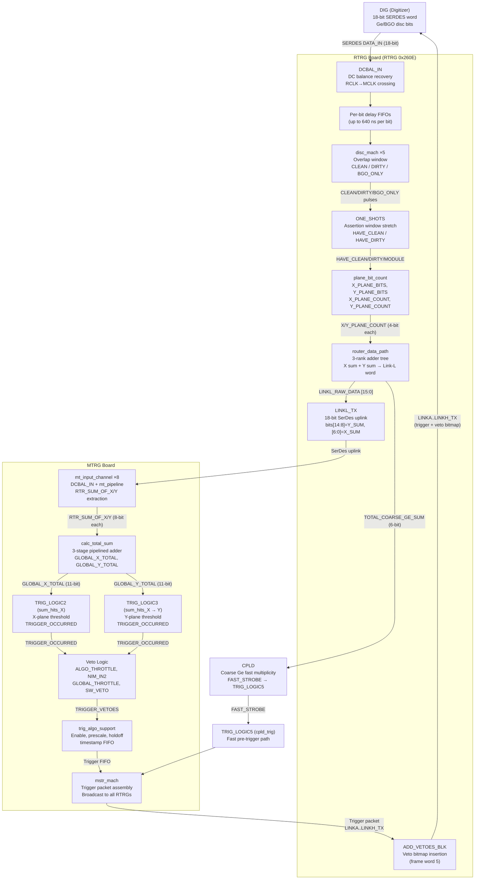

# RTRG 0x260E + MTRG Trigger Scheme
_Firmware: RTRG 0x260E, MTRG (current trunk)_
_Example: 2-detector DUO (BGO ch-0 → Ge ch-5, BGO ch-1 → Ge ch-6; Y_MAP=A5/A6)_
_Source: `DGS_tools_pack/FPGA/` — chan_in.vhd, disc_mach.vhd, router_data_path.vhd, router_top (TOP.VHD), mt_input_channel.vhd, eight_mt_channel.vhd, sum_hits_X.vhd, calc_total_sum.vhd, top.vhd_
_Last updated: 2026-04-17_

---

## Table of Contents

1. [Channel Input (RTRG: chan_in.vhd)](#1-channel-input-rtrg-chan_invhd)
2. [Discriminator & Clean/Dirty Logic (disc_mach.vhd)](#2-discriminator--cleandirty-logic-rtrg-disc_machvhd)
3. [RTRG → MTRG Link Format (router_data_path.vhd)](#3-rtrg--mtrg-link-format-router_data_pathvhd)
4. [RTRG Top-Level (TOP.VHD)](#4-rtrg-top-level-topvhd)
5. [MTRG Input Channel (mt_input_channel.vhd)](#5-mtrg-input-channel-mt_input_channelvhd)
6. [Eight MT Channel — Global Sum Construction (eight_mt_channel.vhd)](#6-eight-mt-channel--global-sum-construction-eight_mt_channelvhd)
7. [Multiplicity Comparison (sum_hits_X.vhd)](#7-multiplicity-comparison-sum_hits_xvhd)
8. [Total Sum Calculation (calc_total_sum.vhd)](#8-total-sum-calculation-calc_total_sumvhd)
9. [MTRG Trigger Decision (top.vhd)](#9-mtrg-trigger-decision-topvhd)
10. [End-to-End Flow (DUO Example)](#10-end-to-end-flow-duo-example)
11. [Mermaid Flow Diagram](#11-mermaid-flow-diagram)

---

## 1. Channel Input (RTRG: chan_in.vhd)

Each RTRG board instantiates one `chan_in` block per digitizer (DIG) connection. `chan_in` is the front-end of the trigger data path: it recovers the discriminator bits from the serial SERDES stream, aligns timing between Ge and BGO channels, classifies hits, and outputs per-plane hit maps and multiplicity counts upstream toward the Master Trigger.

### 1.1 Serial Data Reception

The DIG sends a **18-bit SERDES word** every 20 ns clock: ✅ verified 2026-04-15 — `chan_in.vhd:L16` (comment header: `|CG|FLG|CD9..CD5|D09..D00|POL|` = 18 bits)

```
[17] = CG  (clock guard)
[16] = FLG (sync/frame flag)
[15:10] = CD9..CD4  (coarse/fast Ge discriminators, channels 9:4)
[9:5]  = D09..D05  (Ge center discriminator bits, 5 channels)
[4:0]  = D04..D00  (BGO sum discriminator bits, 5 channels)
[0]    = POL  (DC balance polarity bit)
```

The **DCBAL_IN** sub-block strips the DC balance inversion applied by the SERDES transmitter, then crosses the data from the SERDES clock domain (LVDS_RCLK) into the system master clock (MCLK) via a FIFO. The result is `RECOVERED_DATA[15:0]`: bit 15 = FLG, bits [14:10] = coarse Ge, bits [9:5] = Ge, bits [4:0] = BGO.

A parallel **fast path** (`FAST_D_OUT`) bypasses the FIFO to provide the lowest-latency coarse Ge bits — these feed `COARSE_GE_SUM`, a 3-bit popcount of bits [14:10] used for rapid pre-screening.

### 1.2 Per-Bit Timing Alignment

Ten individual **DPRAM delay-line FIFOs** (one per discriminator bit) correct timing skew between Ge and BGO channels. Each FIFO is up to 32 taps deep (20 ns/tap = **640 ns maximum delay**). ✅ verified 2026-04-15 — `chan_in.vhd:L260,266` (`DEPTH_pwr2 => 5` → 2^5=32 samples × 20 ns = 640 ns; inline comment: "or 640nsec") The per-bit delay values are loaded from `BIT_DELAY` via a VME register write with `LOAD_BIT_DELAY`. When `CLEAN_DIRTY(15)='1'`, the delay-corrected `DELAYED_DATA[9:0]` is used for all downstream logic; otherwise the raw `RECOVERED_DATA` bits are used. ✅ verified 2026-04-16 — `chan_in.vhd:L219,228-229` (`RAW_DATA_OUT <= ... DELAYED_DATA when CLEAN_DIRTY(15)='1' else RECOVERED_DATA`)

### 1.3 Synchronization State Machine (REMAP_BITS_PROC)

Before producing any output, `chan_in` runs a 3-state machine:

| State | Condition | Action |
|---|---|---|
| **IDLE** | `INPUT_MASK='0'` → advance | Zero all outputs |
| **WAIT_DIG_FLAG** | `RECOVERED_DATA[15]` (FLG) = '1' → advance | Hold zeros; wait for frame boundary |
| **REMAP_BITS** | Continuous | Apply X_PLANE_MAP / Y_PLANE_MAP bitmasks; drive outputs |

This ensures every RTRG channel is locked to the same data-frame boundary before forwarding hits.

### 1.4 Discriminator Machines and Hit Classification

Five `discriminator_mach` sub-blocks handle the five Ge/BGO channel pairs (Ge = bits [9:5], BGO = bits [4:0]). Each `disc_mach` examines the timing overlap between a Ge discriminator firing and the corresponding BGO discriminator firing to classify each event:

- **CLEAN_EVENT** — Ge fired, BGO did **not** fire within the overlap window → Ge-only (full-energy deposit)
- **DIRTY_EVENT** — Both Ge and BGO fired within the overlap window → Compton scatter coincidence
- **BGO_ONLY_EVENT** — BGO fired, Ge did not → BGO-shield-only event

One-shot timers (7-bit wide, up to 127 clocks) stretch these single-tick pulses into an **assertion window** (`ASSERTION_DELAY = TSCATTER_DELAY_REG[14:8]`). A retriggerable one-shot restarts its timer on each new event, so a burst of events within the window produces a single extended assertion. The resulting extended flags are:

- `HAVE_CLEAN[4:0]` — asserted for the assertion window after each CLEAN_EVENT per pair
- `HAVE_DIRTY[4:0]` — asserted for the assertion window after each DIRTY_EVENT per pair
- `HAVE_MODULE[4:0]` — asserted for the assertion window after either a CLEAN or DIRTY event

### 1.5 X-Plane and Y-Plane Hit Maps

The `CLEAN_DIRTY` register selects which flag set drives the X and Y output bitmaps:

| CLEAN_DIRTY[3:0] | X_PLANE source | Typical use |
|---|---|---|
| `0000` | `X_BITS` (raw DFMA mapping) | DFMA mode |
| `0001` | `HAVE_CLEAN[4:0]` | DGS clean-hit counting |
| `0010` | `HAVE_DIRTY[4:0]` | DGS dirty-hit counting |
| `0100` | `HAVE_MODULE[4:0]` | DGS any-hit counting |
| `1000` | `HAVE_CLOVER_CLEAN` | Clover geometry |

✅ verified 2026-04-16 — `chan_in.vhd:L490-499` (X_SELECT driven by `CLEAN_DIRTY(3 downto 0)`; Y_SELECT by `CLEAN_DIRTY(7 downto 4)` with same encoding)

`Y_SELECT` (bits [7:4]) picks the Y-plane source independently, allowing X and Y to count different event classes simultaneously.

These bitmaps are further masked by `X_PLANE_MAP` (10-bit) and `Y_PLANE_MAP` (10-bit) registers that specify which discriminator bits belong to each plane. **In our DUO example**, Y_MAP = `A5/A6` means only bits 5 and 6 (Ge ch-5 and Ge ch-6) contribute to the Y-plane count.

Two `plane_bit_count` LUT popcounters produce `X_PLANE_COUNT` and `Y_PLANE_COUNT` (4-bit, 0–10), which are the multiplicity counts forwarded toward the Master Trigger.

### 1.6 Live-Channel Veto Generation

When `ENABLE_VETO='1'`, the `VETO_GEN_PROC` drives `LIVE_CHANNEL_VETO[10:1]` based on DIRTY and BGO-only events. These veto requests propagate to the RTRG top-level ADD_VETOES process to suppress re-triggering during a dirty event window.

### 1.7 DUO Example — Channel Input

In the 2-detector DUO:
- **BGO ch-0 / Ge ch-5**: `disc_mach` instance 0 monitors pair (Ge bit 5, BGO bit 0). A gamma depositing full energy in Ge ch-5 fires Ge bit 5 only → `CLEAN_EVENT[0]` → `HAVE_CLEAN[0]` asserted for ASSERTION_DELAY clocks.
- **BGO ch-1 / Ge ch-6**: `disc_mach` instance 1 monitors pair (Ge bit 6, BGO bit 1). Same logic.
- Y_PLANE_MAP has bits 5 and 6 set → only `HAVE_CLEAN[0]` and `HAVE_CLEAN[1]` feed `Y_PLANE_BITS[5]` and `Y_PLANE_BITS[6]`. `Y_PLANE_COUNT` reflects 0, 1, or 2 clean Ge hits.

---

## 2. Discriminator & Clean/Dirty Logic (RTRG: disc_mach.vhd)

`disc_mach` is the hit-classification engine at the heart of each Ge/BGO detector pair. Five instances run in parallel inside `chan_in`, one per pair. It uses leading-edge detection and a programmable coincidence (overlap) window to produce single-clock-tick output pulses.

### 2.1 Edge Detection

Each clock, `disc_mach` pipelines `GE_DISC_FLAG` and `BGO_DISC_FLAG` one tick and detects rising edges:

- `GE_EDGE` — fires for one tick when Ge transitions from low to high
- `BGO_EDGE` — fires for one tick when BGO transitions from low to high

### 2.2 Four-State Overlap Machine

The state machine uses a 7-bit `OVERLAP_TIMER`, loaded from `OVERLAP_DELAY` (= `TSCATTER_DELAY_REG[6:0]`, 0–127 clocks = 0–1270 ns at 100 MHz):

| State | Description |
|---|---|
| **ST_IDLE** | Waiting. Timer pre-loaded to OVERLAP_DELAY. Exits on any edge. |
| **ST_OVERLAP_GE_FIRST** | Ge fired first; counting down. BGO within window → DIRTY; timer expires → CLEAN. |
| **ST_OVERLAP_BGO_FIRST** | BGO fired first; counting down. BGO retriggering resets timer. Ge within window → DIRTY; timer expires → BGO_ONLY. |
| **ST_WAIT_DIRTY** | Both fired; counting out the remainder of the window, then pulses DIRTY. |

### 2.3 Event Classification Summary

| Scenario | One-tick output |
|---|---|
| Ge rises, no BGO within overlap window | **CLEAN_EVENT** |
| Ge rises first, BGO within overlap window | **DIRTY_EVENT** |
| BGO rises first, Ge within overlap window | **DIRTY_EVENT** |
| BGO rises, no Ge within overlap window | **BGO_ONLY_EVENT** |
| Both rise simultaneously | **DIRTY_EVENT** (after timer expires) |

The single-tick pulses from `disc_mach` are handed back to `chan_in`'s ONE_SHOTS process, which stretches each one into an **assertion window** of up to 127 clocks (`ASSERTION_DELAY = TSCATTER_DELAY_REG[14:8]`). If a new event arrives before the timer expires, the one-shot restarts — producing a continuous assertion across a burst of hits.

### 2.4 DUO Example — Discriminator Classification

**Scenario A — clean Ge hit in ch-5:**

1. A gamma ray deposits full energy in Ge ch-5. Only Ge bit 5 fires.
2. `disc_mach` instance 0: `GE_EDGE='1'`, BGO stays low. Machine enters `ST_OVERLAP_GE_FIRST`.
3. Overlap timer counts down from `OVERLAP_DELAY` (e.g., 10 clocks = 100 ns). No BGO edge arrives.
4. At timer = 0: `CLEAN_EVENT='1'` for one clock tick.
5. `chan_in` ONE_SHOTS: `HAVE_CLEAN[0]` asserted for ASSERTION_DELAY clocks.
6. With `CLEAN_DIRTY[3:0]=0001` and Y_PLANE_MAP bit 5 set: `Y_PLANE_BITS[5]='1'`, `Y_PLANE_COUNT` increments.

**Scenario B — Compton scatter in BGO ch-0 / Ge ch-5:**

1. Gamma Compton-scatters into BGO ch-0 first. BGO bit 0 fires → `BGO_EDGE='1'`.
2. Machine enters `ST_OVERLAP_BGO_FIRST`.
3. Within the overlap window, the scattered gamma deposits energy in Ge ch-5 → `GE_EDGE='1'`.
4. Machine transitions to `ST_WAIT_DIRTY`, counts out timer, then asserts `DIRTY_EVENT='1'`.
5. `HAVE_DIRTY[0]` asserted. With `CLEAN_DIRTY[3:0]=0010` for Y: `Y_PLANE_BITS[5]='1'` in dirty mode; the event is counted differently or vetoed depending on firmware configuration.

---

## 3. RTRG → MTRG Link Format (router_data_path.vhd)

`router_data_path` aggregates all eight `chan_in` instances on one RTRG board and assembles their hit counts into a single 16-bit word — **Link-L** — transmitted to the Master Trigger over a SerDes serial link.

### 3.1 Adder Tree — Pipelined Summation

The eight `chan_in` blocks each produce a 4-bit `X_PLANE_COUNT` and `Y_PLANE_COUNT`. A three-rank pipelined adder tree (one pipeline register per rank) sums all eight:

- **Rank 1**: Four 5-bit partial sums — channels 1+2, 3+4, 5+6, 7+8 (separately for X and Y)
- **Rank 2**: Two 6-bit sums — (ch1-4) and (ch5-8) for each plane
- **Rank 3**: One 7-bit total — final X sum and final Y sum (max 80 each)

The 3-rank pipeline introduces 3 clock cycles (60 ns) of latency between a hit arriving at `chan_in` and the corresponding count appearing in Link-L. ✅ verified 2026-04-15 — `router_data_path.vhd:L210-233` (SUM_HITS process runs on `mclk` = 50 MHz = 20 ns/clock; rank1→rank2→rank3+LINKL are all registered signals so each rank costs one clock edge = 3 clocks × 20 ns = 60 ns total)

### 3.2 Link-L Word Bit-Field Layout

```
Bit [15]    = ANY_THROTTLE_REQUEST  (OR of all 8 digitizer throttle requests)
Bits [14:8] = Y-plane multiplicity sum (7-bit, range 0–80)
Bit [7]     = DATA_VALID  (= ALL_DIGITIZERS_LOCKED AND ROUTER_LOCKED)
Bits [6:0]  = X-plane multiplicity sum (7-bit, range 0–80)
```

✅ verified 2026-04-15 — `router_data_path.vhd:L230-233` (LINKL_RAW_DATA(15) = ANY_THROTTLE_REQUEST; (14:8) = Y sum; (7) = ALL_DIGITIZERS_LOCKED AND ROUTER_LOCKED; (6:0) = X sum)

This 16-bit word occupies bits [16:1] of the 18-bit SerDes frame transmitted to the MTRG.

### 3.3 DATA_VALID Qualification

`DATA_VALID` (bit 7) is asserted only when all eight digitizer SERDES links are locked **and** the Router itself is locked to the Master. If any link loses lock, DATA_VALID drops and the MTRG will discard the word.

### 3.4 Coarse Ge Fast Path

In parallel with the main adder tree, a single-cycle process sums the 3-bit `COARSE_GE_SUM` outputs from all eight `chan_in` instances into a 6-bit `TOTAL_COARSE_GE_SUM` (max 40). This bypasses the FIFO-based clock crossing and provides a faster pre-trigger sum for rapid decisions.

### 3.5 DUO Example — Link-L Contents

In the 2-detector DUO with a clean hit on Ge ch-5 and Ge ch-6 (both firing within the assertion window):

- `chan_in` instances for channels 5 and 6 each contribute 1 to `Y_PLANE_COUNT`
- After the 3-rank adder tree: **Y-plane sum = 2, X-plane sum = 0** (assuming X-plane not mapped)
- Link-L word = `0b 0 0000010 1 0000000` → bits [14:8] = 0b0000010 = 2, bits [6:0] = 0

The MTRG receives `RTR_SUM_OF_Y = 2` for this RTRG, indicating multiplicity-2 in the Y plane.

### 3.6 Diagnostic FIFOs

Each of the eight `chan_in` channels feeds a diagnostic FIFO. A 2-bit mode register selects what is stored: raw discriminator data, any-hit flags, plane counts + disc_mach states, or combined count/raw data. Write-enable modes allow capture on any hit or on a specific channel hit. These are used for commissioning and debugging only; they do not affect the trigger path.

---

## 4. RTRG Top-Level (TOP.VHD)

`TOP.VHD` (`router_top` entity) is the integration layer that wires all RTRG sub-blocks together and manages the bidirectional links to both the digitizers and the Master Trigger.

### 4.1 Uplink to Master Trigger

The uplink chain (Digitizers → MTRG):

1. `ROUTER_DATA_PATH` produces `LINKL_RAW_DATA[15:0]` (X/Y sums, throttle, data-valid).
2. `dc_balance_mach` (U1) applies DC balance encoding → `LINKL_BAL_DATA[17:0]`.
3. `TX_PROC` drives `LINKL_TX` every clock at 50 MHz (100 Mbps SerDes).

### 4.2 Downlink from Master Trigger

The downlink chain (MTRG → Digitizers):

1. `router_main_mach` decodes the incoming 18-bit `LINKL_RX` stream. Frame 12 words carry router-specific commands (counter/FIFO resets); these are decoded by `F12_DECODE` and **replaced with 0xAAAA** in the stream that is forwarded to digitizers (so digitizers never see raw router commands).
2. `ADD_VETOES_BLK` (one state machine per digitizer): monitors the 5-word frame structure. On the 5th word of every frame 1–19, it replaces the outgoing word with the **accumulated live-channel veto bitmap** for that digitizer (10 bits, from `LIVE_CHANNEL_VETOES`). Between insertions the latch accumulates new veto requests via OR. The 5th word of frame 20 is reserved for machine synchronization and is not overridden.
3. Eight `dc_balance_mach` instances re-encode the modified words and drive `LINKA..LINKH_TX` to the digitizers.

### 4.3 Key VME Registers Relevant to Trigger

| Register | Role |
|---|---|
| `Y_PLANE_MAP_REG` | 10-bit bitmap per channel: which disc bits count toward Y-plane (DUO: bits 5,6) |
| `X_PLANE_MAP_REG` | Same for X-plane |
| `CLEAN_DIRTY_REG` | Selects CLEAN/DIRTY/MODULE/Clover source for X and Y hit maps |
| `TSCATTER_DELAY_REG` | [14:8] = assertion window; [6:0] = overlap (coincidence) window |
| `THROTTLE_LIMIT_TIME_REG` | Minimum continuous assertion length before a throttle request is accepted |
| `INPUT_LINK_MASK_REG` | Per-channel dead-channel mask |
| `ENABLE_VETO` | Enables live-channel veto generation |

### 4.4 Coarse Ge Fast Path to CPLD

`TOTAL_COARSE_GE_SUM[5:0]` (summed by `router_data_path` in a single cycle) is transmitted to an on-board CPLD via 3 DDR lines on `SUMCOPY[3:1]`: lower 3 bits on the rising edge, upper 3 bits on the falling edge of the 50 MHz clock. The CPLD uses this 6-bit count for a fast pre-trigger multiplicity decision. The resulting `FAST_STROBE` signal returns from the CPLD to the RTRG for NIM output/diagnostic use. ✅ verified 2026-04-17 — `TOP.VHD:L877-895` (ODDR_inst generate loop ×3: D1=TOTAL_COARSE_GE_SUM(i), D2=TOTAL_COARSE_GE_SUM(i+3) → lower 3 bits on positive edge, upper 3 bits on negative edge of MCLK)

### 4.5 Clock Architecture

- `switched_master_clock` (50 MHz) — used by SerDes TX, router_main_mach, veto insertion, DDR outputs. Source switchable between local oscillator and `LINKL_RCLK` (recovered from MTRG) via a DCM.
- `switched_master_clock_2x` (100 MHz) — used by `chan_in` and `router_data_path` for discriminator processing. Derived from the same DCM 2× output.

### 4.6 DUO Example — TOP.VHD Role

In the DUO, TOP.VHD:
- Distributes `Y_PLANE_MAP_REG` = `0b0000001100000000` (bits 5 and 6 set) to all `chan_in` instances.
- Forwards the MTRG trigger decision received on `LINKL_RX` downstream to both digitizers via `LINKA_TX` and `LINKB_TX`, embedding the veto bitmap on every 5th frame word.
- If the MTRG fires a trigger (multiplicity ≥ 2), the digitizers receive the trigger strobe on the next veto-insertion boundary.

---

## 5. MTRG Input Channel (mt_input_channel.vhd)

`mt_input_channel` is the MTRG-side front-end for one RTRG link. Eight instances run in parallel inside `eight_mt_channel.vhd`, one per RTRG connection. It recovers the serial data stream and extracts the X/Y multiplicity sums and status flags for that RTRG.

### 5.1 DC Balance Recovery

The incoming 18-bit DC-balanced SerDes word from the RTRG is decoded by `DCBAL_IN` (U1), which reverses the DC balance encoding applied in the RTRG's `dc_balance_mach`, and crosses from the SERDES receive clock (LVDS_RCLK) into the MTRG master clock domain via an internal FIFO. The result is `UNBAL_ROUTER_DATA[15:0]` — the original Link-L word.

If `DCBAL_BYPASS='1'` (diagnostic mode), the data passes through without decoding.

### 5.2 Stream Parsing — mt_pipeline

`mt_pipeline` (U2) parses the Router serial frame protocol. One complete data cycle runs approximately every 2 µs; each of the 8 digitizers on the RTRG produces its data staggered ~225 ns apart. `mt_pipeline` extracts per-digitizer fields: CHANNEL_ID (8-bit identifier), SPARE words, and status maps including:

| Map | Description |
|---|---|
| `CHAN_MASK_MAP` | Masked (dead) digitizer channels |
| `ROUTER_LOCK_MAP` | Digitizer SERDES lock status |
| `DIG_CODE_ERR_MAP` | Grey-code error flags |
| `DIG_ERROR_MAP` | Digitizer error bits |
| `DIG_PILEUP_MAP` | Pileup flags |
| `THROTTLE_REQ_MAP` | Per-digitizer throttle requests |

`TRAILER_FLAG` pulses once per Router data cycle at the end of the frame, used by `eight_mt_channel` to synchronize global sum updates.

### 5.3 Multiplicity Extraction

```
MULTIPLICITY[3:0] <= UNBAL_ROUTER_DATA[15:12]  (when not masked)
```
✅ verified 2026-04-18 — `mt_input_channel.vhd:L183` (MTRG/MAIN_FPGA/20120424): `MULTIPLICITY <= UNBAL_ROUTER_DATA(15 downto 12) when (CHANNEL_MASK = '0') else "0000"`

This extracts the top 4 bits of the recovered Link-L word. In the current RTRG 0x260E format, bit [15] = throttle, bits [14:12] = top 3 bits of the 7-bit Y-plane sum. The `MULTIPLICITY` output therefore reflects a partial Y-count (the upper 3 bits, i.e., the value divided by 16 in 7-bit terms) — useful for rapid multiplicity prescreening without needing the full 7-bit sum.

The full X and Y sums (bits [6:0] and [14:8] of the Link-L word) are consumed by higher-level blocks in `eight_mt_channel` that read `RTR_SUM_OF_X` and `RTR_SUM_OF_Y` directly.

### 5.4 Channel Masking

If `CHANNEL_MASK='1'` (this entire RTRG disabled at the MTRG level):
- All CHANNEL_ID and SPARE outputs are zeroed.
- `MULTIPLICITY` is forced to zero.
- `THROTTLE_REQUEST` is forced to zero.
Invalid digitizer slots (`DIGVALID='0'`) within an active RTRG get CHANNEL_ID = 0xFF.

### 5.5 DUO Example — mt_input_channel

The RTRG connected to our 2-detector DUO transmits Link-L with `Y_SUM = 2`. At the MTRG:
- `DCBAL_IN` recovers the 16-bit word.
- `UNBAL_ROUTER_DATA[14:8] = 0b0000010 = 2`.
- `MULTIPLICITY[3:0] = UNBAL_ROUTER_DATA[15:12] = 0b0000` (throttle=0, Y[6:4]=0 → multiplicity shows 0 at this partial extraction, since the count of 2 fits in the lower bits of the 7-bit Y field).
- The full Y sum of 2 is passed to `eight_mt_channel` via the recovered word for proper summing.

---

## 6. Eight MT Channel — Global Sum Construction (eight_mt_channel.vhd)

`eight_mt_channel` bundles eight `mt_input_channel` instances (one per RTRG, Router links A–H) with a `calc_total_sum` adder and assembles the detector-wide X and Y multiplicity totals. It is the aggregation point that turns per-RTRG partial sums into global sums ready for the trigger decision.

### 6.1 Per-RTRG Sum Extraction

Each `mt_input_channel` instance in the trunk variant exposes two additional outputs beyond the base version:

- `RTR_SUM_OF_X[7:0]` — the 7-bit X-plane multiplicity sum from that RTRG's Link-L word (bits [6:0])
- `RTR_SUM_OF_Y[7:0]` — the 7-bit Y-plane multiplicity sum from that RTRG's Link-L word (bits [14:8])

These are 8-bit fields (the 7-bit RTRG sum zero-extended to 8 bits), accommodating the maximum of 80 hits per RTRG (8 channels × 10 discriminator bits each).

### 6.2 Global Sum via calc_total_sum

The `calc_total_sum` instance receives all eight `RTR_SUM_OF_X` and `RTR_SUM_OF_Y` arrays and produces:

- **`GLOBAL_X_TOTAL[10:0]`** — 11-bit total X-plane multiplicity across all 8 RTRGs (max 640)
- **`GLOBAL_Y_TOTAL[10:0]`** — 11-bit total Y-plane multiplicity across all 8 RTRGs (max 640)

The summation is performed in `calc_total_sum` via a 3-stage pipelined adder tree (detailed in section 8).

### 6.3 Global Throttle

`THROTTLE_PROC` registers the OR of all eight `THROTTLE_REQUEST` bits from the `mt_input_channel` instances:

```
GLOBAL_THROTTLE_REQUEST <= '1' if any xROUTER_THROTTLE_REQUESTS(i) = '1'
```

This single bit propagates to the top-level trigger logic to suppress triggers during busy periods.

### 6.4 Channel Status and Masking

- `CHANNEL_STATUS[7:0]` — LOAD_ERR bits from each `mt_input_channel` (link not locked → error)
- `CHANNEL_STATUS[15:8]` — per-Router throttle request bits
- `INPUT_LINK_MASK_REG[7:0]` — per-Router mask; masked channels contribute zero to all sums

### 6.5 DUO Example — eight_mt_channel

In the DUO, only one RTRG (say, link A) is populated. The remaining 7 `mt_input_channel` instances are either masked or report LOAD_ERR. Link A's `mt_input_channel` provides:
- `RTR_SUM_OF_X[7:0] = 0`
- `RTR_SUM_OF_Y[7:0] = 2`

After `calc_total_sum`:
- `GLOBAL_X_TOTAL = 0`
- `GLOBAL_Y_TOTAL = 2`

These feed directly into the trigger comparison blocks.

---

## 7. Multiplicity Comparison (sum_hits_X.vhd)

`sum_hits_X` implements the X-plane multiplicity trigger algorithm. An equivalent Y-plane version handles `GLOBAL_Y_TOTAL`. Both modules share the same structure.

### 7.1 Threshold Comparison — Two-State Machine

The core logic is a simple 2-state leading-edge detector:

| State | Condition | Action |
|---|---|---|
| **WAIT_TRIG** (armed) | `SUM_OF_X > SUM_OF_X_THRESH` | Assert `TRIGGER_OCCURRED` for one tick; go to WAIT_FALL |
| **WAIT_FALL** (fired) | `SUM_OF_X > SUM_OF_X_THRESH` | Stay (de-assert TRIGGER_OCCURRED immediately after the one tick) |
| **WAIT_FALL** (fired) | `SUM_OF_X ≤ SUM_OF_X_THRESH` | Return to WAIT_TRIG (re-arm) |

The comparison is **strictly greater than** (`>`), not `≥`. So `SUM_OF_X_THRESH = 1` fires when the sum reaches 2 or above.

This produces exactly one `TRIGGER_OCCURRED` pulse per threshold-crossing event, no matter how long the sum remains above threshold. Re-arming requires the sum to fall back to or below the threshold.

### 7.2 Trigger Support Infrastructure (trig_algo_support)

The `TRIGGER_OCCURRED` one-tick pulse is passed to `trig_algo_support`, a generic sub-component shared by all MTRG algorithm blocks. It handles:

| Feature | Signal | Description |
|---|---|---|
| Enable gate | `TRIGGER_ENABLE` | VME bit; if '0', triggers are counted but not issued |
| Veto | `TRIGGER_VETO` | External veto (e.g., from throttle); suppresses accepted triggers |
| Self-holdoff | `TRIGGER_HOLDOFF`, `TRIG_HOLDOFF_ENBL` | After firing, suppresses re-triggering for N×20 ns ticks |
| Prescale | `TRIGGER_PRESCALE` | Accept 1 in every N+1 crossings |
| Timestamp FIFO | `TIME_STAMP_BUS` | Captures 48-bit timestamp at trigger time; queued in FIFO for Master collector |
| Distribution mask | `TRIG_DIST_MASK` | 8-bit mask of which RTRGs/digitizers receive this trigger type |
| Throttle feedback | `ALGO_THROTTLE_REQUEST` | Fires when trigger FIFO exceeds 50% full |

### 7.3 Acknowledge Outputs

Three acknowledge signals serve different monitoring roles:

| Signal | Meaning |
|---|---|
| `RAW_NONVETOED_TRIG_ACK` | Threshold crossed + not vetoed (enable ignored) — used by coincidence matrix |
| `ENABLED_TRIG_ACK` | Threshold crossed + enabled (veto ignored) — used for rate counting |
| `ENABLED_NONVETOED_TRIG_ACK` | Threshold crossed + enabled + not vetoed — the actual accepted trigger |

### 7.4 DUO Example — Y-Plane Multiplicity Trigger

With Y-plane threshold set to 1 (fires when `GLOBAL_Y_TOTAL > 1`, i.e., ≥ 2):

- Both Ge ch-5 and Ge ch-6 fire clean hits within the assertion window → `GLOBAL_Y_TOTAL = 2`.
- `sum_hits_Y`: `2 > 1` → `TRIGGER_OCCURRED` pulses.
- `trig_algo_support`: checks TRIGGER_ENABLE and TRIGGER_VETO → if clear, records timestamp, asserts `ENABLED_NONVETOED_TRIG_ACK`, writes event to FIFO.
- After firing, `WAIT_FALL` state holds until `GLOBAL_Y_TOTAL` drops back to ≤ 1 before re-arming.

---

## 8. Total Sum Calculation (calc_total_sum.vhd)

`calc_total_sum` is the adder that merges up to eight per-RTRG X/Y sums into the detector-wide `X_TOTAL` and `Y_TOTAL` signals that feed the threshold comparators in `sum_hits_X`.

### 8.1 Three-Stage Pipelined Adder Tree

All arithmetic is registered, one stage per clock, for a total of **3 clock cycles (60 ns at 50 MHz)** of pipeline latency from per-RTRG sums to final totals:

| Stage | Operation | Output width |
|---|---|---|
| **SUMPROC1** | Pair-wise add: RTR(1)+RTR(2), RTR(3)+RTR(4), RTR(5)+RTR(6), RTR(7)+RTR(8) | 4× 16-bit subtotals per plane |
| **SUMPROC2** | Add pairs of stage-1 results: SUBTOTAL1+2, SUBTOTAL3+4 | 2× 16-bit subtotals per plane |
| **SUMPROC3** | Final add: SUBTOTAL5+SUBTOTAL6 | 16-bit X_TOTAL and Y_TOTAL |

Maximum value: 8 RTRGs × 80 max hits/RTRG = 640 → fits in 10 bits; 16 bits allocated (wider than needed, matches `std_logic_vector(15 downto 0)` port definition). ✅ verified 2026-04-18 — `calc_total_sum.vhd:L22-23,L82-90,L104-105,L120-121` (20180507 tag; all subtotals and X/Y_TOTAL are 16-bit; SUMPROC1/2/3 each registered on CLK edge = 3-cycle pipeline confirmed)

> **Correction (2026-04-18):** Previously documented as 11-bit; VHDL source shows 16-bit throughout.

### 8.2 Y_TOTAL Signal Widths

✅ verified 2026-04-17 — `calc_total_sum.vhd` (20180507 trunk, L35-39): Both `XSUBTOTAL5/6` and `YSUBTOTAL5/6` are correctly declared as `std_logic_vector(15 downto 0)`. The Y path is not truncated. An earlier claim in this document that `YSUBTOTAL5/6` were only 2 bits wide was **incorrect** — no such bug is present in any available firmware tag (20140318, 20140918, 20180507 all verified).

All stage-2 intermediate signals (XSUBTOTAL1–6, YSUBTOTAL1–6) are 16 bits wide, providing ample headroom for summing up to 8 RTRGs × 80 hits/RTRG = 640 max, which fits in 10 bits.

### 8.3 DUO Example — calc_total_sum

Only one RTRG populated (link A); the other seven contribute zero:
- Stage 1: `XSUBTOTAL1 = 0+0 = 0`, `YSUBTOTAL1 = 2+0 = 2`; all others zero.
- Stage 2: `XSUBTOTAL5 = 0`, `YSUBTOTAL5 = 2` (16-bit intermediate — no truncation).
- Stage 3: `X_TOTAL = 0`, `Y_TOTAL = 2`.

All intermediate widths are 16 bits (see section 8.2), so the result is exact for any sum up to 640.

---

## 9. MTRG Trigger Decision (top.vhd)

The MTRG `trigger_top` entity is the hub where all per-RTRG data converges, trigger algorithms run, veto conditions are evaluated, and final trigger decisions are broadcast back to all RTRGs.

### 9.1 Trigger Algorithm Slots (TRIG_LOGIC1–8)

The MTRG supports 8 simultaneous trigger algorithm slots:

| Slot | Module | Input | Description |
|---|---|---|---|
| TRIG_LOGIC1 | `cpld_trig` | `SIMPLE_TRIGGER` (NIM/manual pulse) | NIM or software trigger; type 0x50 |
| **TRIG_LOGIC2** | **`sum_hits_X`** | **`GLOBAL_X_TOTAL`** | **X-plane multiplicity threshold; type 0x51** |
| **TRIG_LOGIC3** | **`sum_hits_X` (Y reuse)** | **`GLOBAL_Y_TOTAL`** | **Y-plane multiplicity threshold (same module, different port mapping)** |
| TRIG_LOGIC4 | `sum_hits_XY` | `GLOBAL_X_TOTAL + GLOBAL_Y_TOTAL` | Combined X+Y multiplicity |
| TRIG_LOGIC5 | `cpld_trig` | `FAST_STROBE` (CPLD) | Fast CPLD pre-trigger strobe |
| TRIG_LOGIC6A/B | `mult_overlap` / `REMOTE_MASTER_TRIG_SUPPORT` | Link L | Local+remote coincidence or remote-only (selected by register) |
| TRIG_LOGIC7 | `REMOTE_MASTER_TRIG_SUPPORT` | Link R | Remote master trigger input |
| TRIG_LOGIC8A/B | `MYRIAD_TRIGGER` / `REMOTE_MASTER_TRIG_SUPPORT` | Link U / MYRIAD | MYRIAD or remote master |

**Key architecture note**: TRIG_LOGIC3 (Y-plane trigger) is literally a second instantiation of `sum_hits_X.vhd`, with `GLOBAL_Y_TOTAL` wired to its `SUM_OF_X` port and `SUM_OF_Y_THRESH` to its `SUM_OF_X_THRESH`. There is no separate `sum_hits_Y.vhd`. ✅ verified 2026-04-17 — `top.vhd:L2423,L2438-2439` (`TRIG_LOGIC3: sum_hits_X` with `SUM_OF_X => GLOBAL_Y_TOTAL, SUM_OF_X_THRESH => SUM_OF_Y_THRESH`)

✅ verified 2026-04-17 — `sum_hits_X.vhd` (20180507 trunk, L80): The threshold comparison uses **strictly greater than (`>`)** only — `if (SUM_OF_X > SUM_OF_X_THRESH)`. There is no `COMPARE_MODE_CTL` bit or `==` mode in this file. An earlier claim that `SUM_OF_X_THRESH[15]` selects between `>` and `==` comparison was **incorrect** — the threshold is treated as a full 16-bit unsigned value with no mode-selection bit.

### 9.2 Veto Logic

Each algorithm slot has an independent veto signal `TRIGGER_VETOES(i)`. A veto is asserted if any of (in priority order):

1. **ALGO_THROTTLE** — any algorithm's trigger FIFO exceeds 50% full. *Unconditional — cannot be masked.*
2. **NIM_IN2** active, with `TRIG_MASK_REG(14)` and per-algorithm `TRIG_VETO_SELECT(i)(0)` enabled.
3. **GLOBAL_THROTTLE_REQUEST** — any RTRG is throttling — with `TRIG_MASK_REG(15)` and `TRIG_VETO_SELECT(i)(2)`.
4. **MON7_VETO_REQUEST** — monitor FIFO #7 overflow, with `TRIG_MASK_REG(13)`.
5. **VETO_FROM_VETO_RAM** — target wheel position veto, with enable bits.
6. **Software veto** — `TRIG_MASK_REG(11)` with per-algorithm select.
7. **ANY_VETO_FROM_REMOTE_MASTER** — propagated veto from a remote Master Trigger.

### 9.3 Master State Machine (mstr_mach) — Trigger Distribution

`mstr_mach` (U2) collects trigger events from all 8 algorithm FIFOs, builds formatted trigger packets, and distributes them to all 8 RTRGs simultaneously via `LINKA..LINKH_TX`. The RTRGs forward these decisions to their digitizers (with veto bitmaps embedded in frame word 5 as described in section 4.2).

`mstr_mach` also manages:
- System synchronization frames (Sync and Imperative Sync)
- Communication with remote Master Triggers via Links L, R, and U
- Frame 12 insertion for Router-specific command delivery

### 9.4 ExtTTCL / FAST_STROBE Path

`FAST_STROBE` arrives from the on-board CPLD. The CPLD receives the 6-bit `TOTAL_COARSE_GE_SUM` from each RTRG (via the DDR SUMCOPY bus) and can generate a fast pre-trigger strobe based on coarse Ge multiplicity — bypassing the full MTRG pipeline latency. On the MTRG side, `FAST_STROBE` drives TRIG_LOGIC5 (`cpld_trig`), which can issue a trigger independently of the RTRG SerDes pipeline.

### 9.5 DUO Example — MTRG Trigger Decision

With `GLOBAL_Y_TOTAL = 2` and `SUM_OF_Y_THRESH = 1` (i.e., fire when Y > 1):

1. **TRIG_LOGIC3** (`sum_hits_X` reused for Y): `2 > 1` → `TRIGGER_OCCURRED` pulses.
2. Veto check: ALGO_THROTTLE = 0, GLOBAL_THROTTLE = 0, NIM_IN2 inactive → `TRIGGER_VETOES(3) = 0`.
3. `trig_algo_support` in TRIG_LOGIC3: accepts the trigger, captures timestamp, writes to FIFO.
4. `mstr_mach` reads FIFO, builds trigger packet with type code (Y-plane multiplicity), asserts trigger on `LINKA_TX`.
5. RTRG receives trigger on `LINKL_RX` → `router_main_mach` decodes it → forwarded to digitizers on `LINKA_TX` (BGO ch-0 / Ge ch-5) and `LINKB_TX` (BGO ch-1 / Ge ch-6).
6. Both digitizers receive the trigger strobe and latch their waveforms.

---

## 10. End-to-End Flow (DUO Example)

A gamma ray strikes Ge ch-5 at time T=0. Here is the complete step-by-step trigger path:

**T+0 ns** — Gamma deposits full energy in Ge ch-5. The DIG fires Ge discriminator bit 5. BGO bit 0 stays silent.

**T+20 ns** — DIG SERDES transmits the discriminator word to the RTRG. `DATA_IN[9]` (Ge bit 5) = 1.

**T+20..60 ns** — `DCBAL_IN` recovers the data word and crosses to MCLK domain. `RECOVERED_DATA[9] = 1`.

**T+60 ns** — `REMAP_BITS_PROC` (in state REMAP_BITS) gates bit 9 through the Y_PLANE_MAP (bit 5 set). `Y_PLANE_BITS[5] = 1`.

**T+60..160 ns** — `disc_mach` instance 0 detects `GE_EDGE`, enters `ST_OVERLAP_GE_FIRST`. Counts `OVERLAP_DELAY` clocks (e.g., 10 clocks = 100 ns) with no BGO edge. At timer=0: `CLEAN_EVENT` pulses.

**T+160 ns** — `ONE_SHOTS` in `chan_in`: `HAVE_CLEAN[0]` asserted for `ASSERTION_DELAY` clocks (e.g., 20 clocks = 200 ns). `Y_PLANE_BITS[5] = 1` for the assertion window.

**T+160 ns** (simultaneously, ch-6 if second gamma hits Ge ch-6) — Same sequence produces `HAVE_CLEAN[1]`, `Y_PLANE_BITS[6] = 1`.

**T+160..220 ns** — `router_data_path` 3-rank adder tree sums `Y_PLANE_COUNT` from both active `chan_in` instances: Y sum = 2, X sum = 0.

**T+220 ns** — `LINKL_RAW_DATA` = `0b0_0000010_1_0000000` (Y=2, DATA_VALID=1, X=0). `dc_balance_mach` encodes → `LINKL_TX` drives the RTRG→MTRG SerDes link.

**T+220..~430 ns** — SerDes transmission at 100 Mbps, MTRG `DCBAL_IN` recovers the word, `mt_input_channel` extracts `RTR_SUM_OF_Y = 2`.

**T+430..490 ns** — `calc_total_sum` 3-stage adder tree: `Y_TOTAL = 2` after 3 clock cycles (60 ns).

**T+490 ns** — `sum_hits_X` (TRIG_LOGIC3, Y reuse): `2 > 1` → `TRIGGER_OCCURRED`.

**T+490 ns** — Veto check passes. `trig_algo_support` accepts trigger, captures timestamp.

**T+490..~600 ns** — `mstr_mach` reads FIFO, formats trigger packet, drives `LINKA_TX` (downlink to RTRG).

**T+600..700 ns** — RTRG `router_main_mach` decodes trigger from `LINKL_RX`. `ADD_VETOES_BLK` inserts trigger decision (plus veto bitmap) into digitizer downlink on next frame-word-5 slot.

**T+700+ ns** — Digitizers for Ge ch-5 and Ge ch-6 receive the trigger strobe and latch their data buffers for readout.

**Total latency**: Approximately 700–800 ns from gamma hit to digitizer trigger receipt, dominated by the RTRG adder tree, SerDes link delays, and MTRG adder tree.

---

## 11. Mermaid Flow Diagram



> **DUO configuration**: Only Ge ch-5 (BGO ch-0) and Ge ch-6 (BGO ch-1) are active. Y_PLANE_MAP = A5/A6 (bits 5 and 6). CLEAN_DIRTY = 0x0101 (Y=HAVE_CLEAN, X=HAVE_CLEAN). SUM_OF_Y_THRESH = 1. A coincident clean hit on both Ge channels produces GLOBAL_Y_TOTAL = 2, crosses the threshold, and fires TRIG_LOGIC3.


---

## See Also

- `knowledgeBase/deep_fpga_RTRG.md` — RTRG firmware overview: Virtex-4 device, source file index, VME register map, disc_mach.vhd, Router→MTRG SERDES frame format
- `knowledgeBase/fpga.md` — System-level trigger hierarchy: DIG→RTRG→MTRG signal flow, end-to-end timing, throttle mechanism
- `knowledgeBase/deep_fpga_MTRG_MAIN.md` — MTRG: consumes RTRG multiplicity/hit data to make global trigger decisions
- `knowledgeBase/deep_fpga_DIG.md` — DIG: upstream source of the 18-bit SERDES words that chan_in.vhd receives
- `knowledgeBase/ttcl.md` — TTCL frame format: frames 12/14 (inter-trigger/remote trigger) that the RTRG forwards with nulls
