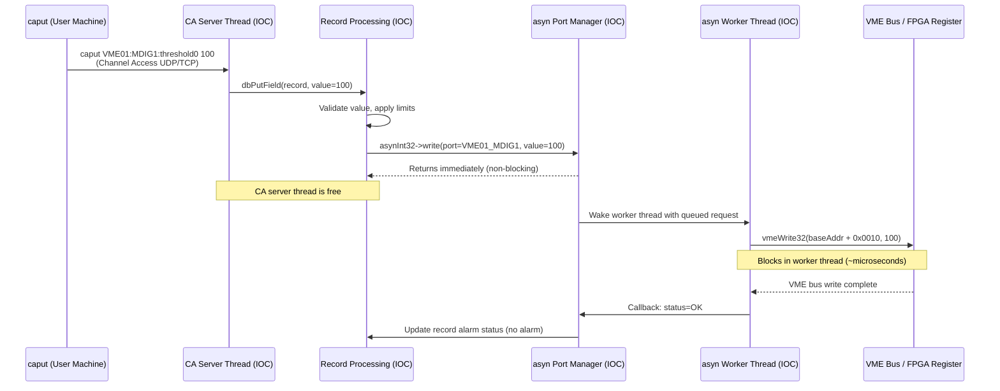
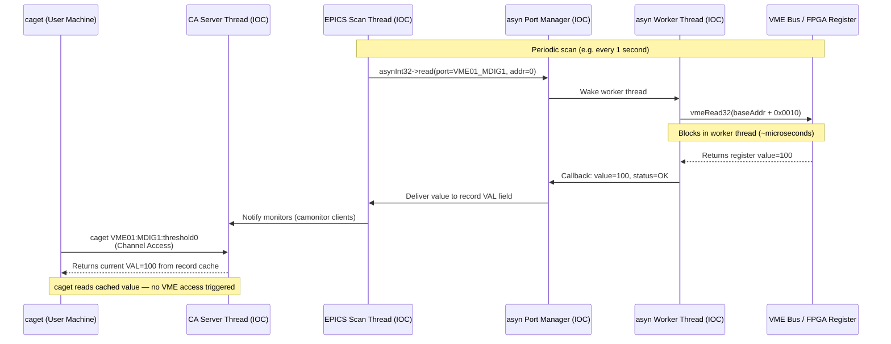
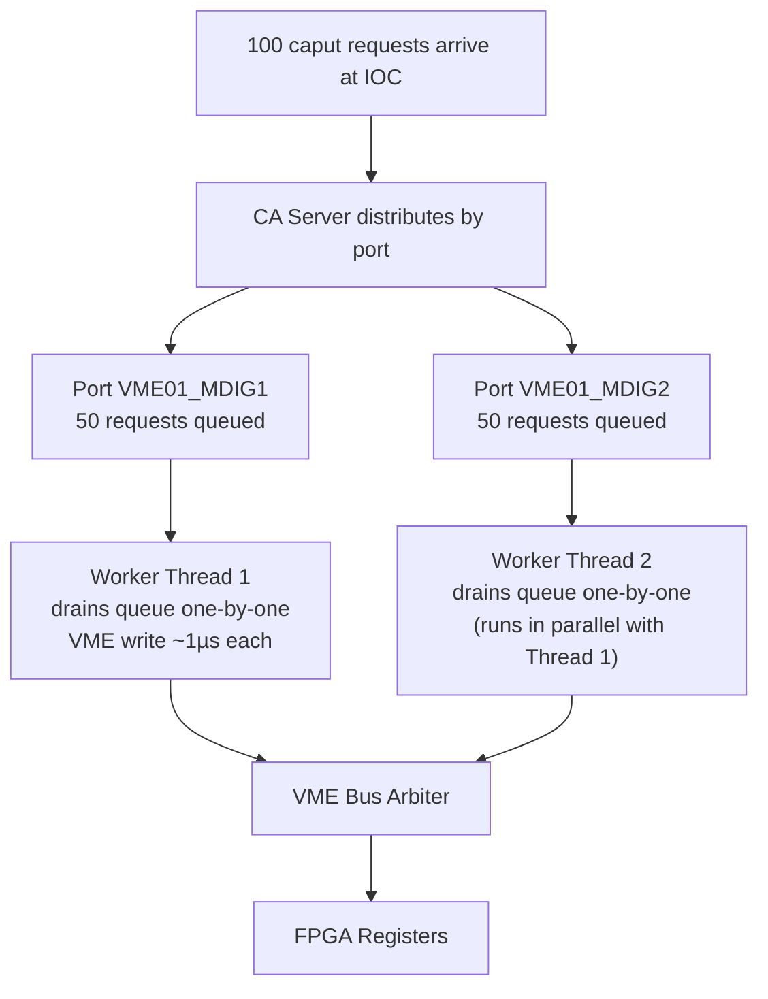

# EPICS asyn — Asynchronous Driver Support

Stability: C3 - Structural / stable

_How asyn works under the hood, with DGS context._

---

## What Is asyn?

**asyn** = Asynchronous Driver Support for EPICS. It is a middleware layer between EPICS records and hardware drivers.

**The problem it solves:** Without asyn, every hardware driver must implement EPICS device support directly — handling record types, scan locking, callbacks, etc. asyn provides a **standardized read/write interface** so:
- Hardware drivers implement one clean API
- Standard device support handles all the EPICS record glue
- Drivers can be non-blocking without deadlocking the IOC scan threads

---

## Mental Model: What asyn Does

asyn is a **broker** between EPICS records and hardware:

- **Write (caput → hardware):** asyn queues the write request, a worker thread does the actual hardware access, then calls back with success/error. The calling thread does not wait.
- **Read (caget ← hardware):** same — asyn queues the read, worker thread fetches the value, callback delivers it to the record.
- **Errors do come back** — as record alarms (`SEVR`/`STAT` → `INVALID`/`COMM_ALARM`). It is not fire-and-forget.
- **The "async" part** = the IOC scan thread is never blocked. The actual hardware I/O is synchronous inside the worker thread.

---

## Full caput Flow



## Full caget Flow



---

## Programs & Threads Involved in One caput

| What | Where | Thread |
|------|-------|--------|
| `caput` CLI | User's machine | User's shell process |
| CA server | Inside IOC process | CA server thread |
| Record processing | Inside IOC process | CA server thread |
| asyn port manager | Inside IOC process | CA server thread (queues, returns) |
| asyn worker | Inside IOC process | 1 dedicated thread per port |
| Hardware driver | Inside IOC process (compiled in) | Worker thread |
| VME bus + FPGA | Hardware | — |

**Key:** It's all **one process** on the IOC. The driver is not a separate program — it's a `.o` file compiled and linked into the IOC binary (`gretDet.munch` in DGS). The threads are VxWorks tasks.

---

## What Is an asyn Port?

A **port** is a named logical connection to one piece of hardware — registered by the driver at IOC startup:

```c
// In ioc/boot/vme66.cmd (actual DGS syntax):
asynDigitizerConfig("MDIG1",   // port name (arbitrary string, local to this IOC)
                    0,          // asyn address index
                    3)          // VME slot number
```

**Port ≈ one addressable hardware unit.** In DGS, one port = one board. Actual port names from `ioc/boot/vme66.cmd` ✅ verified 2026-04-08 — `ioc/boot/vme66.cmd:L133-140`:

| Port name | Maps to |
|-----------|---------|
| `"MDIG1"` | Master DIG board (asyn addr 0, VME slot 3), crate 66 |
| `"MDIG2"` | Slave DIG board (asyn addr 1, VME slot 4), crate 66 |
| `"RTR1"` | RTRG board (asyn addr 4, VME slot 6), crate 66 |
| `"MTRG"` | MTRG board (asyn addr 5, VME slot 7), crate 66 |

Port names are short, board-local strings — not prefixed with crate number. Each IOC cmd file registers its own ports independently. Port names are abstract strings; asyn works the same way for VME, serial, USB, SPI, Ethernet.

---

## Bulk caput: 100 Simultaneous Writes

When pyepics fires 100 `caput` calls at once with `wait=False`:



**Key rules:**
- 1 worker thread per port → writes to one board are always serialized
- Multiple ports run in parallel → MDIG1 and MDIG2 writes are concurrent
- No 100 threads needed — the queue absorbs the burst
- VME bus arbiter handles physical contention

- **1 worker thread per port** — writes to one board are always serialized (hardware can only handle one VME access at a time) ✅ verified 2026-04-08 — `asynDigitizerDriver.cpp:L346-351` (`epicsThreadCreate("asynDigitizerDriver_Task", ...)` once per constructor call)
- **Multiple ports run in parallel** — MDIG1 and MDIG2 writes happen truly concurrently
- **No 100 threads needed** — the queue absorbs the burst
- **VME bus arbiter** handles contention at the hardware level when multiple boards are accessed simultaneously

---

## Typed Interfaces

asyn defines typed interfaces matching data types:

| Interface | Data type | Use case |
|-----------|-----------|----------|
| `asynInt32` | 32-bit integer | Register values, thresholds, counters |
| `asynUInt32Digital` | 32-bit with mask | Bit fields, enable/disable bits |
| `asynFloat64` | 64-bit float | Calibration coefficients, temperatures |
| `asynOctet` | String / byte array | Status strings, waveform data |

The driver implements whichever interfaces its hardware needs.

---

## Passive Hardware — How "Callbacks" Work

For a passive device (VME register, switch) that cannot initiate communication:

1. EPICS scan engine triggers the record at its configured scan rate (e.g., "1 second")
2. Record asks asyn: "read now"
3. asyn worker thread calls `vmeRead32(address)` — this **blocks** in the worker thread (microseconds for VME)
4. Worker gets value, **driver calls the callback itself**: `pasynUser->callback(value, status=OK)`
5. asyn delivers value to record; record updates VAL, notifies camonitor clients

The hardware is completely dumb — **the IOC polls**; the "callback" is the driver signaling completion internally, not hardware calling back.

For interrupt-driven hardware, the interrupt handler calls `setIntegerParam()` + `callParamCallbacks()` — pushing updates without polling.

---

## asyn in DGS

- Used in the VxWorks VME IOC (`gretDet.munch`) — asyn **4-17** cross-compiled for MVME5500 ✅ verified 2026-04-19 — `vxworks/dgsIoc/configure/RELEASE:L22`: `ASYN=$(TOP)/../synApps/asyn4-17`; EPICS base 3.14.12.1; sncseq 2.0.12; build maintained by JTA/MBO (last touched 2022)
- Each DIG, RTRG, MTRG board = one asyn port
- Port name format: short board-local strings (e.g., `"MDIG1"`, `"MDIG2"`, `"RTR1"`, `"MTRG"`) ✅ verified 2026-04-08 — `ioc/boot/vme66.cmd:L133-140`
- The collector box Pi IOC uses an older `CAMAC_IO` device support style (pre-asyn) — direct device support, no asyn layer ✅ verified 2026-04-19 — `collectorboxpi/CollectorBox_RevA/CollectorApp/src/CollectorSupport.dbd`: all device registrations use `CAMAC_IO` (not `INST_IO` or asyn); DTYP strings `CollectorLocalSerial`, `CollectorSoftControl`, `CollectorI2CSerial` all map to `CAMAC_IO`

### DGS-Specific `asynUInt32Digital` Mask Encoding

_Source: `vxworks/dgsDrivers/dgsDriverApp/src/asynDigitizerDriver.cpp:L379-404` ✅ verified 2026-04-08_

The DGS asyn digitizer driver extends the standard `asynUInt32Digital` mask with a **custom sub-field encoding** for bit-field registers. When the PSG spreadsheet generates DB records for a multi-bit sub-field (e.g., a 5-bit field starting at bit 3), the mask is encoded as: ✅ verified 2026-04-20 — `asynDigitizerDriver.cpp:L379-404` (read path: L382 sentinel check `(mask&0xffff0000)==0xaaaa0000`, L384 `numbits=(mask&0x0000ff00)/256`, L387 `shift=mask&0x000000ff`; write path: L436-453 same pattern)

```
mask = 0xaaaa_NNSS
  where:
    0xaaaa0000  = sentinel (top 16 bits) indicating sub-field mode
    NN (bits 15:8 of lower word) = number of bits in the sub-field
    SS (bits 7:0  of lower word) = shift (bit position where field starts)
```

**Example:** A 5-bit field starting at bit 3 → `mask = 0xaaaa0503`

The driver decodes this as:
1. Detects `0xaaaa` sentinel in high 16 bits
2. Extracts `numbits = 5`, `shift = 3`
3. Builds real mask: `(2^5 - 1) << 3 = 0b11111000 = 0xF8`
4. Calls base `asynPortDriver::readUInt32Digital()` with real mask
5. Right-shifts result by `shift` to return the sub-field value directly ✅ verified 2026-04-20 — `asynDigitizerDriver.cpp:L400` (`if (is_long) *value=(*value)>>shift`)

For raw whole-register reads (no sub-field), the mask is a standard bitmask with no `0xaaaa` sentinel.

> Note: The comment in the source acknowledges this is somewhat awkward — `mask` is reused as a local variable and the code notes it "probably should just pass cmask" (`L399-404` comment block) — but it works correctly in practice.

---

---

## Cross-References

- `knowledgeBase/EPICS.md` — EPICS primer: record types, CA tools, Python integration
- `knowledgeBase/ioc.md` — IOC boot scripts, startup sequence, DB loading
- `knowledgeBase/vxworks.md` — VxWorks cross-compilation; where `asynDigitizerDriver.cpp` lives
- `knowledgeBase/VME_registers.md` — VME byte-offset addresses used in driver `ReadReg`/`WriteReg` calls
- `knowledgeBase/vxworks_vme_devlayer.md` — VME hardware abstraction below the asyn layer: `devGVME.c` board init, `VMERead32`/`VMEWrite32`, flash ops, `daqBoards[]` global array, `DGS_DEFS.h` constants
- `knowledgeBase/vxworks_trigger_drivers.md` — asyn trigger driver deep-dive (`asynTrigCommonDriver`, `asynTrigMasterDriver`, `asynTrigRouterDriver`): same `0xaaaa0000` sub-field mask pattern as the digitizer driver, applied to MTRG/RTRG VME registers
- `knowledgeBase/snapshot_pv.md` — uses `epics.caput`/`caget` (Python-side of the same asyn chain)

*Created: 2026-04-06 from conversation with Ryan Tang.*
