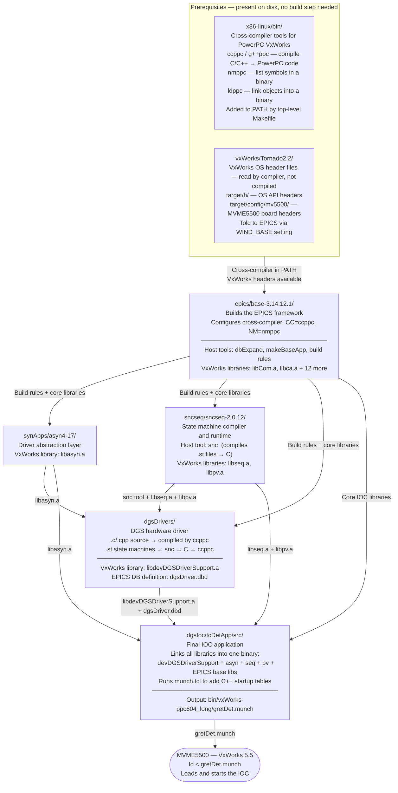

# VxWorks Cross-Compiler for DGS IOC (MVME5500)

Stability: C2 - Active / semi-stable

## Table of Contents

- [What this project does](#what-this-project-does)
- [Directory Structure](#directory-structure)
- [Component Roles](#component-roles)
  - [`x86-linux/` — Cross-compiler toolchain](#x86-linux----cross-compiler-toolchain)
  - [`vxWorks/Tornado2.2/` — VxWorks header files](#vxworkstornado22----vxworks-header-files)
  - [`epics/base-3.14.12.1/` — EPICS base framework](#epicsbase-314121----epics-base-framework)
  - [`synApps/asyn4-17/` — Hardware driver abstraction (asyn)](#synappsasyn4-17----hardware-driver-abstraction-asyn)
  - [`sncseq/sncseq-2.0.12/` — State machine compiler and runtime](#sncseqsncseq-2012----state-machine-compiler-and-runtime)
  - [`dgsDrivers/` — DGS hardware driver library](#dgsdrivers----dgs-hardware-driver-library)
  - [`dgsIoc/` — Final IOC application](#dgsioc----final-ioc-application)
  - [`munch.tcl` — C++ startup table generator](#munchtcl----c-startup-table-generator)
  - [`munch_build_date.py` — Embedded build-date extractor](#munch_build_datepy--embedded-build-date-extractor)
- [Target Hardware](#target-hardware)
- [Host Requirements](#host-requirements)
- [Build](#build)
- [Build Pipeline](#build-pipeline)
- [Build Outputs](#build-outputs)
  - [Stage 1 — Intermediate libraries](#stage-1----intermediate-libraries-inputs-to-dgsioc)
  - [Stage 2 — Final loadable](#stage-2----final-loadable-produced-by-dgsioc)
- [VxWorks Munch Process](#vxworks-munch-process)
- [Loading on VxWorks (MVME5500)](#loading-on-vxworks-mvme5500)
- [Glossary](#glossary)
- [Source](#source)
- [VxWorks API Reference Docs](#vxworks-api-reference-docs)
- [FIFO Readout Internals](#fifo-readout-internals) → see [vxworks_fifo_readout.md](vxworks_fifo_readout.md)
- [Connections to Other Subsystems](#connections-to-other-subsystems)
- [Quick Notes](#quick-notes)
- [devGData.c — Legacy VME_IO Device Support (Removed 2025-04-21)](#devgdatac--legacy-vme_io-device-support-removed-2025-04-21)
- [Utility / Support Modules](#utility--support-modules-minor-files) → see [vxworks_utility_modules.md](vxworks_utility_modules.md) and [vxworks_vme_devlayer.md](vxworks_vme_devlayer.md)
- [State Machines & Runtime Drivers](#state-machines--runtime-drivers) → see [vxworks_state_machines.md](vxworks_state_machines.md)
- [Cross-References](#cross-references)

---

## What this project does

The DGS (Digital Gamma-ray Spectrometer) detector system uses a small dedicated computer — a Motorola MVME5500 board running inside a VME crate — to read out data from gamma-ray detector electronics in real time. That computer runs **VxWorks 5.5** ✅ verified 2026-04-07 — `vxworks/Makefile:L2`, a real-time operating system designed for embedded hardware where timing and reliability matter more than user-friendliness.

To write software for the MVME5500, you cannot compile it on the board itself — the board has no development tools and is too slow for that. Instead, you compile on a modern Linux PC and produce a binary that runs on the PowerPC CPU inside the MVME5500. This is called **cross-compilation**: the machine you compile on (Ubuntu x86-64) is different from the machine that runs the result (PowerPC VxWorks).

This repository contains everything needed to reproduce that cross-compilation on Ubuntu 24, starting from source code and ending with `gretDet.munch` — the single binary file that gets loaded onto each MVME5500 crate to bring the detector IOC online. ✅ verified 2026-04-07 — `dgsDrivers/dgsDriverApp/src/README.md:L744` ("IOC boot: gretDet.munch loaded by VxWorks shell")

---

## Directory Structure

```
VxWorks/
├── Makefile                        # Top-level build orchestrator — run 'make' here
├── README.md                       # This file
├── migration.md                    # Notes on migration from con6 (Solaris)
├── munch.tcl                       # Script that adds C++ startup tables to the binary
├── x86-linux/                      # Cross-compiler tools (not in git — see below)
│   └── bin/                        # ccppc, g++ppc, nmppc, ldppc, ...
├── vxWorks/Tornado2.2/             # VxWorks system header files (not compiled, just #included)
│   └── target/
│       ├── h/                      # VxWorks OS headers (vxWorks.h, semLib.h, ...)
│       └── config/mv5500/          # MVME5500 board-specific headers (universe.h, etc.)
├── epics/base-3.14.12.1/           # EPICS base framework — provides the build system and core libraries  ✅ verified 2026-04-07 — ls vxworks/epics/
├── synApps/asyn4-17/               # asyn — hardware driver abstraction layer  ✅ verified 2026-04-07 — ls vxworks/synApps/
├── sncseq/sncseq-2.0.12/           # State machine compiler and runtime  ✅ verified 2026-04-07 — ls vxworks/sncseq/
├── dgsDrivers/                     # DGS hardware driver library (built here, linked into dgsIoc)
│   └── lib/vxWorks-ppc604_long/
│       └── libdevDGSDriverSupport.a
└── dgsIoc/                         # Final IOC application — produces the file loaded on the board
    └── bin/vxWorks-ppc604_long/
        └── gretDet.munch           # The single binary loaded on each MVME5500
```

---

## Component Roles

### `x86-linux/` — Cross-compiler toolchain

This folder contains the compiler tools that run on your Ubuntu PC but produce code for the PowerPC CPU in the MVME5500. These are not the same as the system `gcc` on your PC — they speak a completely different instruction set.

Key tools:
- `ccppc` / `g++ppc` — C and C++ compilers targeting PowerPC VxWorks
- `ldppc` — linker that combines compiled pieces into a single binary
- `nmppc` — reads a binary and lists all its exported symbols (function/variable names)

These are pre-built binaries from Jefferson Lab; they are not compiled from source and are excluded from git (too large). Re-download from https://coda.jlab.org/drupal/content/ppc-cross-compilers. ✅ verified 2026-04-07 — `vxworks/README.md:L78,L194`

---

### `vxWorks/Tornado2.2/` — VxWorks header files

These are not compiled — they are **header files** (`.h`) that the compiler reads while compiling the driver code, so it knows the interface to VxWorks OS functions. Think of them as the VxWorks API reference that the compiler uses to check your code.

- `target/h/` — general VxWorks OS headers (`semLib.h`, `taskLib.h`, `vxWorks.h`, ...)
- `target/config/mv5500/` — MVME5500-specific headers, most importantly `universe.h` which describes the Universe II VME bridge chip registers

---

### `epics/base-3.14.12.1/` — EPICS base framework ✅ verified 2026-04-18 — `vxworks/epics/base-3.14.12.1/` directory exists

EPICS (Experimental Physics and Industrial Control System) is the control system framework used across most physics labs worldwide. It provides:

- A **build system** (based on GNU make with EPICS-specific rules) that all downstream components inherit. It knows how to cross-compile for VxWorks, how to run the munch step, etc.
- **Core runtime libraries** for the VxWorks target: channel access networking (`libca.a`), database processing (`libdbCore.a`), common utilities (`libCom.a`), and more.
- **Host tools** used during the build: `dbExpand` (merges database definition files), `makeBaseApp`, etc.

Building EPICS base is the first step — everything else depends on it.

---

### `synApps/asyn4-17/` — Hardware driver abstraction (asyn) ✅ verified 2026-04-18 — `vxworks/synApps/asyn4-17/` directory exists

asyn is a standard EPICS add-on that provides a clean interface between EPICS database records and hardware drivers. Instead of each driver implementing its own threading, locking, and EPICS integration from scratch, drivers implement a standard "port driver" interface and asyn handles the rest.

The DGS digitizer and trigger drivers (`asynDigitizerDriver.cpp`, `asynTriggerDriver.cpp`) are all asyn port drivers.

Produces `libasyn.a` for the VxWorks target.

---

### `sncseq/sncseq-2.0.12/` — State machine compiler and runtime ✅ verified 2026-04-18 — `vxworks/sncseq/sncseq-2.0.12/` directory exists

The State Notation Compiler (snc/seq) lets you write control logic as **state machines** in a high-level language (`.st` files), then compiles them to C code that runs as tasks on VxWorks.

Two parts:
- `snc` — a **host tool** (runs on Ubuntu) that compiles `.st` → `.c`
- `libseq.a` / `libpv.a` — **VxWorks libraries** that execute those compiled state machines at runtime

The DGS driver uses three state machine files for its data flow control logic: `inLoop.st` (VME readout), `outLoop.st` (data validation), and `MiniSender.st` (network transmission).

---

### `dgsDrivers/` — DGS hardware driver library

This is the physics-lab-specific code: reading VME digitizer and trigger FIFOs via DMA, managing data buffers, controlling acquisition, sending data over the network. It uses all the frameworks above (EPICS, asyn, sncseq) and adds the hardware-specific logic on top.

Produces:
- `libdevDGSDriverSupport.a` — the compiled driver library for VxWorks
- `dgsDriver.dbd` — EPICS database definition file listing all the PV (Process Variable) record types this driver provides

This library is an **input** to `dgsIoc` — it is not directly loaded on the hardware.

---

### `dgsIoc/` — Final IOC application

This is the top-level application that ties everything together and produces the actual binary loaded on the MVME5500. "IOC" stands for Input/Output Controller — the software instance running on the hardware board.

`dgsIoc/tcDetApp/src/Makefile` declares the final product and lists every library it needs:

```makefile
gretDet_LIBS += devDGSDriverSupport  # from dgsDrivers/
gretDet_LIBS += asyn                 # from synApps/
gretDet_LIBS += seq pv               # from sncseq/
gretDet_LIBS += $(EPICS_BASE_IOC_LIBS)  # from epics/
```

The EPICS build system bundles all of those libraries into a single binary (`gretDet.munch`) via the munch process described below.

Also contains:
- `iocBoot/iocArray/vme*.cmd` — startup scripts run on each MVME5500 at boot
- `db/` — EPICS database template files (`.template`, `.db`) defining PVs
- `dbd/` — merged database definition

---

### `munch.tcl` — C++ startup table generator

VxWorks 5.5 does not automatically call C++ static constructors (code that runs when a program loads) or destructors (code that runs when it unloads). The "munch" step works around this: it scans the compiled binary for constructor/destructor symbols and generates a small C file that registers them, which is then compiled and linked back into the final binary. Without this step, any C++ objects with static initialization would silently fail to initialize. ✅ verified 2026-04-12 — `vxworks/munch.tcl:L124` (matches `__STI__`/`__STD__` ctor/dtor symbols from `nm` output); `L64-65` (generates `ctors`/`dtors` arrays "to be called by runtime system")

---

## Target Hardware

| Item | Detail |
|---|---|
| **Board** | Motorola MVME5500 ✅ verified 2026-04-07 — `dgsDrivers/src/README.md:L4` |
| **CPU** | PowerPC 604 (`ppc604_long` ABI) ✅ verified 2026-04-07 — `dgsDrivers/src/README.md:L4` ("PowerPC board") + ABI dir name `vxWorks-ppc604_long` |
| **OS** | Wind River VxWorks 5.5 ✅ verified 2026-04-07 — `vxworks/migration.md:L26` ("VxWorks 5.5 compatible") |
| **Crate bus** | VME — boards talk to each other over the VME backplane |
| **VME bridge** | Universe II chip — connects the PowerPC CPU to the VME bus ✅ verified 2026-04-07 — `dgsDrivers/src/README.md:L229` ("MVME5500's Universe II chip bridges the PowerPC") |
| **Toolchain** | Tornado 2.2 / GCC 2.96 (`ccppc`, `g++ppc`, `nmppc`, `ldppc`) ✅ verified 2026-04-07 — `vxworks/migration.md:L21,L26` (Tornado2.2 dirs + "GCC 2.96, powerpc-wrs-vxworks") |

---

## Host Requirements

**OS**: Ubuntu 24.04 LTS (linux-x86_64)

**Packages**:
```bash
sudo apt-get install gcc-12 g++-12 flex libfl-dev make perl tcl
```

| Package | Why it is needed |
|---|---|
| `gcc-12` / `g++-12` | Host C/C++ compiler. GCC 13 is too strict for the older C++98 code in EPICS 3.14. |
| `flex` + `libfl-dev` | Lexer generator used to build `snc` (the state machine compiler). |
| `perl` | Used by EPICS build system scripts. |
| `tcl` | Used by `munch.tcl`. |

**Cross-compiler**: pre-installed at `x86-linux/` (from https://coda.jlab.org/drupal/content/ppc-cross-compilers)

---

## Build

```bash
# Build everything in order (epics → asyn → sncseq → dgsDrivers → dgsIoc)
make

# Build individual components
make epics
make asyn
make sncseq
make dgsDrivers
make dgsIoc

# Clean everything
make clean

# Clean individual components
make clean-epics
make clean-asyn
make clean-sncseq
make clean-dgsDrivers
make clean-dgsIoc
```

The Makefile automatically sets `EPICS_HOST_ARCH=linux-x86_64` and prepends `x86-linux/bin` to `PATH` so the cross-compiler tools are found first.

All paths inside the build system are self-relative — no absolute paths need to be updated when the project directory is moved or renamed.

---

## Build Pipeline

The diagram below shows how each component depends on the others. Arrows represent "provides input to". Build order must follow this dependency chain — EPICS base must be built before anything else.



---

## Build Outputs

The build is a two-stage pipeline. The first stage builds libraries; the second stage links them all into the single file that runs on the hardware.

### Stage 1 — Intermediate libraries (inputs to dgsIoc)

These are compiled code libraries (`.a` files — think of them as packages of pre-compiled functions). They are not loaded on the hardware directly; they are ingredients for the final binary.

| File | What it contains |
|---|---|
| `epics/base-3.14.12.1/lib/vxWorks-ppc604_long/*.a` | 14 EPICS base libraries — channel access, database engine, utilities |
| `synApps/asyn4-17/lib/vxWorks-ppc604_long/libasyn.a` | Driver abstraction layer |
| `sncseq/sncseq-2.0.12/lib/vxWorks-ppc604_long/libseq.a` | State machine runtime |
| `dgsDrivers/lib/vxWorks-ppc604_long/libdevDGSDriverSupport.a` | DGS hardware driver code |
| `dgsDrivers/dbd/dgsDriver.dbd` | EPICS process variable definitions |

### Stage 2 — Final loadable (produced by dgsIoc)

| File | What it is |
|---|---|
| `dgsIoc/bin/vxWorks-ppc604_long/gretDet.munch` | The complete IOC binary — all libraries bundled in, ready to load on VxWorks |
| `gretDet.munch` | Copy in the project root — convenient for deployment to the MVME5500 |

---

## VxWorks Munch Process

VxWorks 5.5 is an older embedded OS that does not automatically run C++ initialization code when a binary is loaded. The "munch" process works around this limitation. It is run automatically by the EPICS build system as part of producing any VxWorks binary.

**Step by step:**

1. **Compile** — each `.c`, `.cpp`, and `.st` source file is compiled to a `.o` object file (a compiled but not yet combined fragment).

2. **Link** — all `.o` object files and all `.a` libraries are combined by `ldppc` into a single binary file called `gretDet`. This binary is in **ELF format** (Executable and Linkable Format — the standard binary format on Linux and VxWorks). At this point the binary is complete but is missing C++ initialization.

3. **Extract constructor symbols** — `nmppc gretDet` reads the binary's symbol table (the list of all function and variable names inside) and pipes it into `munch.tcl`. The script looks for special symbols named `_GLOBAL__I_*` (C++ static constructors — functions that must run at load time) and `_GLOBAL__D_*` (destructors — run at unload time).

4. **Generate registration code** — `munch.tcl` writes a small C file (`gretDet_ctdt.c`) containing arrays of those constructor/destructor function pointers.

5. **Re-link** — `gretDet_ctdt.c` is compiled and linked back into the binary, producing `gretDet.munch`. When VxWorks loads this file, the startup code walks those arrays and calls every constructor, properly initializing all C++ objects.

```
Source files (.c, .cpp, .st)
        │ compile with ccppc
        ▼
  Object files (.o)  +  Libraries (.a)
        │ link with ldppc
        ▼
  gretDet  (ELF binary, missing C++ init)
        │ nmppc | munch.tcl
        ▼
  gretDet_ctdt.c  (C++ constructor/destructor table)
        │ compile + re-link
        ▼
  gretDet.munch  (complete ELF binary, ready for VxWorks)
```

---

### `munch_build_date.py` — Embedded Build-Date Extractor

_Source: `DGS_tools_pack/vxworks/munch_build_date.py` — documented 2026-04-25_

A small Python 3 utility that extracts **EPICS-embedded build timestamps** from a compiled `.munch` binary without recompiling or running the binary. Useful when filesystem `mtime` cannot be trusted (e.g., after `scp`/`rsync`/`tar` that resets timestamps) but you still need to know when the binary was built.

**Why it works:** EPICS base bakes build-time strings into the `.rodata` section of every binary it compiles. These strings survive any file copy. The only way to change them is to recompile.

**Usage:**
```bash
python3 munch_build_date.py gretDet.munch
python3 munch_build_date.py gretDet.munch gretDet_linux.munch   # compare multiple
```

**Output per file:** file path, size in bytes, filesystem `mtime`, and up to four recognised embedded strings:

| Label | Pattern matched |
|-------|----------------|
| `SEQ build` | `SEQ Version X.Y.Z: <date>` |
| `EPICS Base built` | `EPICS Base built <date>` |
| `CA Client Library` | `EPICS ..., CA Client Library <date>` |
| `Misc Utilities` | `EPICS ..., Misc. Utilities Library<date>` |

**Implementation:** Reads binary in full; extracts printable ASCII strings ≥ 8 characters (`[ -~]{8,}`); scans against four EPICS/SEQ regex patterns. Pure Python stdlib only (`re`, `sys`, `pathlib`, `datetime`). ✅ verified 2026-04-25 — `vxworks/munch_build_date.py:L1-82`

---

## Loading on VxWorks (MVME5500)

Only one file needs to be transferred to the board and loaded. `gretDet.munch` contains everything — EPICS base, asyn, the state machine runtime, and the DGS driver — all statically bundled in. On the VxWorks shell:

```
ld < gretDet.munch
```

`ld` is the VxWorks dynamic loader command. The `<` redirects the file into it. VxWorks loads the binary into memory, resolves addresses, calls all the C++ constructors registered by the munch step, and the IOC starts up.

This matches the existing startup scripts in `dgsIoc/iocBoot/iocArray/vme*.cmd`.

---

## Glossary

| Term | Meaning |
|---|---|
| **Cross-compilation** | Compiling code on one machine (Ubuntu x86-64) to run on a different machine (PowerPC VxWorks) |
| **VxWorks** | A real-time operating system by Wind River, used in embedded hardware where deterministic timing is critical |
| **EPICS** | Experimental Physics and Industrial Control System — a widely used control system framework in physics labs |
| **IOC** | Input/Output Controller — the software instance running on a hardware board, managing detector readout and control |
| **VME** | A hardware bus standard used in physics and industrial instrumentation for connecting boards in a crate |
| **Universe II** | The chip on the MVME5500 that connects the PowerPC CPU to the VME bus; all VME register and DMA access goes through it |
| **ELF** | Executable and Linkable Format — the standard binary file format on Linux and VxWorks. Stores compiled machine code, data, and a symbol table |
| **`.a` file** | A static library — a collection of compiled `.o` object files bundled together. Linked into the final binary at build time |
| **`.o` file** | Object file — a single compiled source file, not yet linked with others |
| **Munch** | A VxWorks-specific post-processing step that adds C++ constructor/destructor registration tables to a binary |
| **DMA** | Direct Memory Access — hardware reads data directly into memory without CPU involvement, used for high-speed VME readout |
| **PV** | Process Variable — an EPICS named data channel that can be read or written over the network |
| **DBD** | Database Definition — an EPICS file describing what record types and PVs a driver provides |
| **asyn** | EPICS driver framework that standardizes the interface between hardware drivers and EPICS records |
| **snc / seq** | State Notation Compiler / Sequencer — compiles state machine `.st` files to C, runs them as tasks on VxWorks |
| **GCC 2.96** | The old C/C++ compiler version in the cross-toolchain. Modern GCC cannot replace it for this target |
| **ppc604_long** | The specific PowerPC ABI (binary interface) used by the MVME5500 — "long" means 32-bit long integers |

---

## Source

Original code lives on `con6` (Solaris, `192.168.203.136`, user `dgs`).
See `migration.md` for a full list of what was copied and what was changed.

## VxWorks API Reference Docs

HTML and PDF reference manuals are archived in `DGS_tools_pack/DGS_SVN/dgs/VxWorksDocs/`:

| File | Contents |
|------|----------|
| `sockLib.html` | Socket library API (`socket()`, `bind()`, `listen()`, `accept()`, `connect()`) — used in `SendReceiveSupport.c` |
| `msgQLib.html` | Message queue API (`msgQCreate()`, `msgQSend()`, `msgQReceive()`) — used in `inLoop.st` queuing |
| `msgQShow.html` | Message queue diagnostic/show functions |
| `msgQSmLib.html` | Shared-memory message queue API |
| `hostLib.html` | Host name/IP resolution (`hostGetByName()`) — used for IOC network setup |
| `Tornado-Guide.pdf` | Tornado 2 IDE user guide |
| `Vx-Progr-Guide1.pdf` | VxWorks Programmer's Guide (task model, I/O, networking) |
| `Tornado-getStart.pdf` | Getting Started guide |

Useful when reading `SendReceiveSupport.c`, `inLoop.st`, or any networking/IPC code in the IOC.

---
*Source: `DGS_tools_pack/vxworks/README.md`. Created: 2026-04-05.*

---

## FIFO Readout Internals

> 📄 **See [`vxworks_fifo_readout.md`](vxworks_fifo_readout.md)** for full detail on:
> - DMA Buffer Architecture (buffer pool, msgQ queues, trigger throttle)
> - Trigger FIFO Readout (`readTrigFIFO.c`, `CheckAndReadTrigger()`, FIFO index map)
> - Type-F synthetic headers (both trigger and digitizer paths)

_Split to separate file 2026-04-20 to keep `vxworks.md` under 500 lines._

---

## Connections to Other Subsystems

- **ioc/** — `gretDet.munch` ends up in `ioc/bin/`; `dgsDriver.dbd` ends up in `ioc/dbd/`
- **fpga/** — drivers in `dgsDrivers/` communicate with DIG/RTRG/MTRG firmware via VME registers
- **ANLDAQ** — EPICS PVs exposed by the IOC are the interface ANLDAQ uses
- **EPICS.md** — EPICS primer: record types, CA protocol, device support, .dbd/.db/.cmd roles
- **EPICS_asyn.md** — asyn driver internals used by the VME IOC records
- **vxworks_migration.md** — Solaris/con6 → Ubuntu 24 migration notes
- **troubleshooting.md** — IOC connectivity issues, SYNC bit gotcha, FIFO problems

---

## Quick Notes

- EPICS 3.14 (not 7.0) — VxWorks IOC uses the older EPICS. Do not mix with EPICS 7.0 paths.
- Cross-compiler is NOT in git — must download from JLab before building
- `migration.md` documents how this was ported from Solaris/con6 to Ubuntu
- Each VME crate loads the same `gretDet.munch` but uses a different boot script with crate-specific parameters

---

## devGData.c — Legacy VME_IO Device Support (Removed 2025-04-21)

`devGData.c` was an EPICS device support module for `VME_IO`-type records. It provided three device sets:
- **`devAiGData`** — `ai` records; signal codes 0x01–0x0b mapped to per-board channel rates, 0xc to card latency, 0xd/0xe to KB sent/read diff. All handlers were **commented out** — effectively a no-op.
- **`devBoGData`** — `bo` records; writing to signal=1 set `daqBoards[card].EnabledForReadout`. This was the original PV-controlled mechanism for enabling boards in inLoop.
- **`devAoGData`** — `ao` records; simply stored `pao->rval` to `pao->val` — a pass-through for state machine use.

**Removed from the build:** `dgsDrivers/dgsDriverApp/src/Makefile:L63` — `JTA 20250421: removed`. The file still exists in the source tree but is no longer compiled into `gretDet.munch`.

**Current mechanism for `EnabledForReadout`:** `devGVME.c` initializes it to 0 in `devGVMECardInit()`. `inLoop.st` maps `VME{CRATE}:{BOARD}:CS_Ena` PVs (monitored via `DECLMON`) to per-board enable flags via `SetupBoardAddresses()` — replacing the old VME_IO PV approach. The `CS_Ena` PV pattern is documented in `ANLDAQ.md`.

✅ verified 2026-04-19 — `devGData.c` full read + `dgsDriverApp/src/Makefile:L63` + `inLoop.st:L167,535`

---

## Utility / Support Modules (Minor Files)

> 📄 **See [`vxworks_utility_modules.md`](vxworks_utility_modules.md)** for full detail on:
> - **`profile.c / profile.h`** — VxWorks CPU profiling framework (33.3 MHz timebase, prescaling, PAUSABLE mode, task-switch hook)
> - **`asynDebugDriver.cpp`** — generic VME peek/poke debug driver (IOCShell `viIn32`/`viOut32` commands)
> - **`FlashMaintenance.c`** — VME FPGA flash register address constants (0x0900–0x098C range)
> - **`equalSub.c`** — EPICS equality subroutine record (compares up to 12 inputs; used for crate status checks)
> - **`restoreSub.c`** — async EPICS PV restore subroutine (`fdbrestore()`, PACT-style callback)
> - **`MergedAsynDigParams.c`** — registers all 222 DIG asyn parameters (`#include`d into `drvAsynDigitizer.c`)
>
> **`devGVME.c` / `DGS_DEFS.h` / `FlashMaintenance.c` (hardware layer):**
> See [`vxworks_vme_devlayer.md`](vxworks_vme_devlayer.md) for the VME hardware abstraction layer — `daqBoards[]` struct, `VMERead32`/`VMEWrite32` primitives, flash programming functions, and `DGS_DEFS.h` constants.

_Split to separate files 2026-04-23/25 to keep `vxworks.md` under 500 lines._

---

## State Machines & Runtime Drivers

> 📄 **See [`vxworks_state_machines.md`](vxworks_state_machines.md)** for full detail on:
> - **inLoop.st** — VME FIFO readout state machine (data acquisition, FIFO polling, board enable)
> - **outLoop.st** — data validation and buffer routing state machine
> - **MiniSender.st** — TCP data send state machine (port 9001)
> - **Port 9010 On-Demand FIFO Grabber** (planned, not implemented)
> - **Trigger board drivers** (summary level; full deep-dive in `vxworks_trigger_drivers.md`)
> - **vmeDriverMutex** — shared VME bus mutex for flash programming synchronization
> - **QueueManagement.c** — three-queue buffer pool (qFree/qWritten/qSender)
>
> 📄 **See [`vxworks_trigger_drivers.md`](vxworks_trigger_drivers.md)** for the trigger asyn driver deep-dive:
> - `asynTrigCommonDriver` base class (poll loop, `address_list[]`, `0xaaaa0000` mask), `asynTrigMasterDriver` (MTRG, 369 params), `asynTrigRouterDriver` (RTRG, 188 params), firmware type code table, boot sequence

_Split to separate file 2026-04-23 to keep `vxworks.md` under 650 lines._

---

## Cross-References

- [`ioc.md`](ioc.md) — IOC config, boot scripts, firmware versions, MVME5500 setup
- [`vxworks_migration.md`](vxworks_migration.md) — Detailed migration notes from Solaris/con6 to Ubuntu 24
- [`vxworks_fifo_readout.md`](vxworks_fifo_readout.md) — DMA buffer architecture, trigger FIFO readout, Type-F headers
- [`vxworks_state_machines.md`](vxworks_state_machines.md) — inLoop/outLoop/MiniSender state machines, trigger driver summary, queue management
- [`vxworks_trigger_drivers.md`](vxworks_trigger_drivers.md) — trigger asyn driver deep-dive (asynTrigCommonDriver, asynTrigMasterDriver, asynTrigRouterDriver, firmware type codes)
- [`EPICS_asyn.md`](EPICS_asyn.md) — asyn driver internals: port model, worker threads, write flow
- [`vxworks_vme_devlayer.md`](vxworks_vme_devlayer.md) — extended devGVME/devGData/DGS_DEFS reference: VME flash register map, `ConfigureFlash` register sequence, `DGS_DEFS.h` constants, `rawEvt` buffer descriptor, board type table, outLoop globals
- [`VME_registers.md`](VME_registers.md) — VME register addresses used by the IOC driver
- [`fpga.md`](fpga.md) — FPGA firmware overview; the firmware binaries loaded by VxWorks
- [`ANLDAQ.md`](ANLDAQ.md) — High-level pipeline overview (inLoop/outLoop/MiniSender data flow diagram + key PVs)
- [`ANLDAQ_tcpReceiver.md`](ANLDAQ_tcpReceiver.md) — tcpReceiverMT protocol; the TCP receiver MiniSender connects to
- [`deep_fpga_RTRG.md`](deep_fpga_RTRG.md) / [`deep_fpga_MTRG_MAIN.md`](deep_fpga_MTRG_MAIN.md) — RTRG/MTRG FPGA firmware

*Created: 2026-04-05 | Last reviewed: 2026-04-25*
